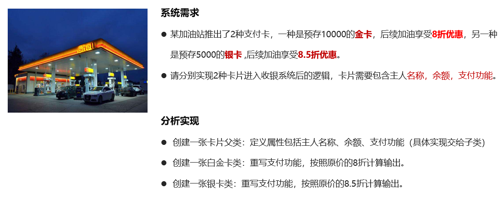
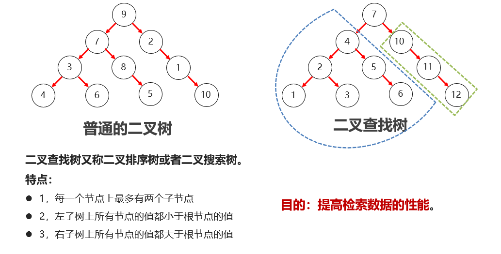
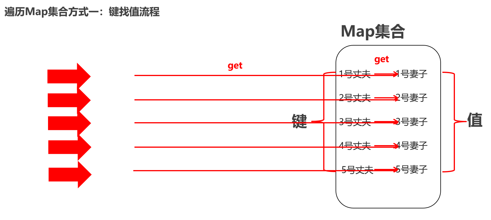

# **Java** SE


## Day 1 面向对象基础知识

### 面向对象思想概述、类、对象

- 面向就是拿或找的意思
- 对象就是东西的意思
- 面向对象编程就是就是拿或找东西过来编程

#### 面向对象编程的例子

```java
public class Test {
	public static void main(String[] args) {
        // 1、创建一个扫描器对象，用于接收用户输入的数据
        System.out.println("请您输入您的年龄：");
        int age = sc.nextInt();
        System.out.println(age);
        // 2、得到一个随机数对象，用于得到随机数      
        int data = r.nextInt(10) + 1 ; // 生成 1-10之间的随机数
        System.out.println(data);
    	}
}
```

#### 定义类的注意事项

- 类名建议首字母大写。满足驼峰模式。
- 一个Java文件中可以定义多个类，但是只能有一个类是用public修饰的，public修饰的类名必须成为Java代码的文件名称。
- 按照规范：建议一个Java文件只定义一个类。

#### 类中部分

- 类中可以定义的5大成分：成员变量、构造器、成员方法、代码块、内部类

  1. **成员变量**Field：描述类或者对象的属性信息，如：姓名、年龄。

  2. **成员方法**Method: 描述类或者对象的行为的，如：唱歌、吃饭、买票。

  3. **构造器**Constructor: 初始化一个类的对象返回。

```java
public class Student{
	private String name;//成员变量
	public Student(){}//构造器
	public void run(){}//方法
	static{}//代码块
	public class Heart{}//内部类
}
```

### 构造器

```java
public class Student {
	// 成员变量
	private String name;
	private int age;
	// 1、无参数构造器
	public Student(){
	
	}
    // 2、有参数构造器
    public Student(String name, int age) {
    	this.name = name;
    	this.age = age;
    }
    
    // getter + setter方法
}

```

#### 总结

1. 构造器的作用？

	- **初始化类的对象，并返回对象的地址。**

2. 构造器有几种，各自的作用是什么？

	- **无参数构造器：初始化的对象时，成员变量的数据均采用默认值。**

	- **有参数构造器：在初始化对象的时候，同时可以为对象进行赋值。**
3. 构造器有哪些注意事项？

	 - **任何类定义出来，默认就自带了无参数构造器，写不写都有。**

	- **一旦定义了有参数构造器，无参数构造器就没有了，此时就需要自己写无参数构造器了。**

### this关键字

- 作用：出现在成员方法、构造器中代表当前对象的地址，用于指定访问**当前对象**的成员变量、成员方法。

- this出现在**构造器**，或者**方法**中，哪个对象调用他们，this就代表哪个对象

```java
public class User {
    private String name;
    private String loginName;
    private String passWord;
    private int age;

    // 构造器 ： 无参数构造器是默认存在的
    public User(){
        System.out.println("无参数构造器被触发执行~~~");
    }

    // 有参数构造器
    public User(String name, String loginName, String passWord, int age) {
        this.name = name;
        this.loginName = loginName;
        this.passWord = passWord;
        this.age = age;
    }
}
```

### 封装

**面向对象的三大特征：**封装**、**继承**、**多态。

- 封装基本思想：解决属性和方法属于哪个对象的问题。

- 封装步骤：通常将成员变量私有、提供方法进行暴露。

- 封装作用：提高业务功能设计的安全性，提高程序逻辑性和开发效率。

**特征的含义：**

- 所谓特征指的是已经成为Java设计代码的基本特点，即使毫无意义，通常也要需要满足这样的设计要求来编写程序。

### 标准JavaBean

- 成员变量使用 **private** 修饰。
- 提供每一个成员变量对应的**get()**和**set()**。
- 必须提供一个**无参构造器。**

```java
public class User {
    private String name;
    private double height;
    private double salary;
    private String introduce;

    public User() {
    }

    public User(String name, double height, double salary, String introduce) {
        this.name = name;
        this.height = height;
        this.salary = salary;
        this.introduce = introduce;
    }

    public String getName() {
        return name;
    }

    public void setName(String name) {
        this.name = name;
    }

    public double getHeight() {
        return height;
    }

    public void setHeight(double height) {
        this.height = height;
    }

    public double getSalary() {
        return salary;
    }

    public void setSalary(double salary) {
        this.salary = salary;
    }

    public String getIntroduce() {
        return introduce;
    }

    public void setIntroduce(String introduce) {
        this.introduce = introduce;
    }
}
```


## Day 2 面向对象进阶（static、单例、代码块、继承）

### **静态关键字: static**

#### static的作用、修饰成员变量的用法
static是静态的意思，可以修饰**成员变量和成员方法**。
static修饰成员变量表示该成员变量只在内存中只存储一份，可以被**共享访问、修改**。

```java
public class User {
    // 在线人数信息：静态成员变量
    public static int onLineNumber = 161;
    // 实例成员变量
    private String name;
    private int age;

    public static void main(String[] args) {
        // 1、类名.静态成员变量
        User.onLineNumber++;
        // 注意：同一个类中访问静态成员变量，类名可以省略不写
        System.out.println(onLineNumber);

        // 2、对象.实例成员变量
        // System.out.println(name);
        User u1 = new User();
        u1.name = "猪八戒";
        u1.age = 36;
        System.out.println(u1.name);
        System.out.println(u1.age);
        // 对象.静态成员变量(不推荐这样访问)
        u1.onLineNumber++;

        User u2 = new User();
        u2.name = "孙悟空";
        u2.age = 38;
        System.out.println(u2.name);
        System.out.println(u2.age);
        // 对象.静态成员变量(不推荐这样访问)
        u2.onLineNumber++;

        System.out.println(onLineNumber);

    }
}
```

#### static修饰成员变量的内存原理


#### static修饰成员方法的基本用法

- **成员方法的分类**：
  - 静态成员方法（有static修饰，属于类），**建议用类名访问**，也可以用对象访问。
  - 实例成员方法（无static修饰，属于对象），**只能用对象触发访问**
- **使用场景**
	- 表示对象自己的行为的，且方法中需要访问实例成员的，则该方法必须申明成实例方法。
	- 如果该方法是以执行一个共用功能为目的，则可以申明成静态方法。

```java
public class ArrayUtils {
    //把它的构造器私有化
    private ArrayUtils(){
    }
    
    //静态方法，工具方法
    public static String toString(int[] arr){
        if(arr != null ){
            String result = "[";
            for (int i = 0; i < arr.length; i++) {
                result += (i == arr.length - 1 ? arr[i] : arr[i] + ", ");
            }
            result += "]";
            return result;
        }else {
            return null;
        }
    }
    
    //静态方法，工具方法
    public static double getAverage(int[] arr){
        // 总和  最大值 最小值
        int max = arr[0];
        int min = arr[0];
        int sum = 0;
        for (int i = 0; i < arr.length; i++) {
            if(arr[i] > max){
                max = arr[i];
            }
            if(arr[i] < min){
                min = arr[i];
            }
            sum += arr[i];
        }
        return (sum - max - min)*1.0 / (arr.length - 2);
    }
}
```

```java
public class Test2 {
    public static void main(String[] args) {
        int[] arr = {10, 20, 30};
        System.out.println(arr);
        System.out.println(ArrayUtils.toString(arr));
        System.out.println(ArrayUtils.getAverage(arr));

        int[] arr1 = null;
        System.out.println(ArrayUtils.toString(arr1));
        int[] arr2 = {};
        System.out.println(ArrayUtils.toString(arr2));

    }
}
```

#### static修饰成员方法的内存原理


#### static实际应用案例：设计工具类

- **工具类**：工具类中定义的都是一些**静态方法**，每个方法都是**以完成一个共用的功能为目的**。
- **工具类的好处**：一是**调用方便**，二是提高了**代码复用**（一次编写，处处可用）
- 为什么工具类中的方法**不用实例方法**做？ 

  - 实例方法需要创建对象调用，此时用对象只是为了**调用方法**，这样只会**浪费内存**。
- **工具类的定义注意**

  - 建议将工具类的构造器进行私有，工具类无需创建对象。
- 里面都是静态方法，直接用类名访问即可。

```java
public class VerifyTool {

    //私有构造器
    private VerifyTool(){
    }

	//静态方法
    public static String createCode(int n){
        // 1、使用String开发一个验证码
        String chars = "abcdefghijklmnopqrstuvwxyzABCDEFGHIJKLMNOPQRSTUVWXYZ0123456789";
        // 2、定义一个变量用于存储5位随机的字符作为验证码
        String code = "";
        // 3、循环
        Random r = new Random();
        for (int i = 0; i < n; i++) {
            int index = r.nextInt(chars.length());
            // 4、对应索引提取字符
            code += chars.charAt(index);
        }
        return code;
    }
}
```

```java
public class Register {
    public static void main(String[] args) {
        // 验证码：
        System.out.println("验证码：" + VerifyTool.createCode(5));
    }
}
```

#### static的注意事项总结

- **static访问注意实现**：
  - 静态方法**只能访问静态的成员**，**不可以直接访问实例成员**。
  
  - **实例方法**可以访问**静态的成员**，也可以访问**实例成员**。
  
  - 静态方法中是不可以出现**this关键字的**。 
  
```java
public class Test {
    // 静态成员变量
    public static int onLineNumber;
    // 实例成员变量
    private String name;

    public static void getMax(){
        // 1、静态方法可以直接访问静态成员,不能访问实例成员。
        System.out.println(Test.onLineNumber);
        System.out.println(onLineNumber);
        inAddr();

        // System.out.println(name);

        // 3、静态方法中不能出现this关键字
        //System.out.println(this);
    }

    public void run(){
        // 2、实例方法可以直接访问静态成员，也可以访问实例成员
        System.out.println(Test.onLineNumber);
        System.out.println(onLineNumber);
        Test.getMax();
        getMax();

        System.out.println(name);
        sing();

        System.out.println(this);
    }

    public void sing(){
        System.out.println(this);
    }

    // 静态成员方法
    public static void inAddr(){
        System.out.println("我们在黑马程序员~~");
    }

    public static void main(String[] args) {

    }
}
```

### **static应用知识：代码块**

#### **代码块概述**

- 代码块是类的**5大成分之一**（成员变量、构造器，方法，**代码块**，内部类），**定义在类中方法外**。

- 在Java类下，**使用 { } 括起来**的代码被称为代码块 。

#### **代码块分类**

- **静态代码块**:
- **格式**：static{}
- **特点**：需要通过static关键字修饰，随着类的加载而加载，并且自动触发、只执行一次。
- **使用场景**：在类加载的时候做一些静态数据初始化的操作，以便后续使用。
- **构造代码块**（**了解，用的少**）：
- **格式**：{}
- **特点**：每次创建对象，调用构造器执行时，都会执行该代码块中的代码，并且在构造器执行前执行。
- **使用场景**：初始化实例资源。

```java
public class StaticCodeTest3 {
    /**
       模拟初始化牌操作
         点数: "3","4","5","6","7","8","9","10","J","Q","K","A","2"
         花色: "♠", "♥", "♣", "♦"
       1、准备一个容器，存储54张牌对象，这个容器建议使用静态的集合。静态的集合只加载一次。
     */
    // int age = 12;
    public static ArrayList<String> cards = new ArrayList<>();

    /**
       2、在游戏启动之前需要准备好54张牌放进去，使用静态代码块进行初始化
     */
    static{
        // 3、加载54张牌进去。
        // 4、准备4种花色：类型确定，个数确定了
        String[] colors = {"♠", "♥", "♣", "♦"};
        // 5、定义点数
        String[] sizes = {"3","4","5","6","7","8","9","10","J","Q","K","A","2"};
        // 6、先遍历点数、再组合花色
        for (int i = 0; i < sizes.length; i++) {
            // sizes[i]
            for (int j = 0; j < colors.length; j++) {
                cards.add(sizes[i] + colors[j]);
            }
        }
        // 7、添加大小王
        cards.add("小🃏");
        cards.add("大🃏");
    }

    public static void main(String[] args) {
        System.out.println("新牌：" +  cards);
    }
}
```

```java
public class TestDemo1 {

    public static String schoolName;

    public static void main(String[] args) {
        // 目标：学习静态代码块的特点、基本作用
        System.out.println("=========main方法被执行输出===========");
        System.out.println(schoolName);
    }

    /**
     特点：与类一起加载，自动触发一次，优先执行
     作用：可以在程序加载时进行静态数据的初始化操作（准备内容）
     */
    static{
        System.out.println("==静态代码块被触发执行==");
        schoolName = "黑马程序员";
    }
}
```

```java
public class TestDemo2 {

    private String name;

    /**
       属于对象的，与对象一起加载，自动触发执行。
     */
    {
        System.out.println("==构造代码块被触发执行一次==");
        name = "张麻子";
    }

    public TestDemo2(){
        System.out.println("==构造器被触发执行==");
    }

    public static void main(String[] args) {
        // 目标：学习构造代码块的特点、基本作用
        TestDemo2 t = new TestDemo2();
        System.out.println(t.name);

        TestDemo2 t1 = new TestDemo2();
        System.out.println(t1.name);
    }

}
```

### **static应用知识：单例**

#### **什么是设计模式（Design pattern）**

  - 开发中经常遇到一些问题，一个问题通常有n种解法的，但其中肯定有一种解法是最优的，这个最优的解法被人总结出来了，称之为设计模式。
  - 设计模式有20多种，对应20多种软件开发中会遇到的问题，学设计模式主要是学2点：
    - 第一：这种模式用来解决什么问题。
    - 第二：遇到这种问题了，该模式是怎么写的，他是如何解决这个问题的。

#### **单例模式**

  - 可以保证系统中，应用该模式的这个类永远只有一个实例，即一个类永远只能创建一个对象。

  - 例如任务管理器对象我们只需要一个就可以解决问题了，这样可以节省内存空间。

#### **饿汉单例设计模式**

  - 在用类获取对象的时候，对象已经提前为你创建好了。

- **设计步骤：**
  - 定义一个类，把构造器私有。
  - 定义一个静态变量存储一个对象

```java
public class SingleInstance1 {
    /**
       static修饰的成员变量，静态成员变量，加载一次，只有一份
     */
    // public static int onLineNumber = 21;
    public static SingleInstance1 instance = new SingleInstance1();

    /**
        1、必须私有构造器：私有构造器对外不能被访问。
     */
    private SingleInstance1(){
    }
}
```

```java
public class Test {
    public static void main(String[] args) {
		//SingleInstance1 s1 = new SingleInstance1();
		//SingleInstance1 s2 = new SingleInstance1();
		//SingleInstance1 s3 = new SingleInstance1();

        SingleInstance1 s1 = SingleInstance1.instance;
        SingleInstance1 s2 = SingleInstance1.instance;
        SingleInstance1 s3 = SingleInstance1.instance;
        System.out.println(s1);
        System.out.println(s2);
        System.out.println(s3);
        System.out.println(s1 == s2);
    }
}
```

#### **饿汉单例设计模式**

  - 在真正需要该对象的时候，才去创建一个对象(延迟加载对象)。

- **设计步骤：**
  - 定义一个类，把构造器私有。
  - 定义一个静态变量存储一个对象
  - 提供一个返回单例对象的方法

```java
public class SingleInstance2 {
    /**
       2、定义一个静态的成员变量用于存储一个对象，一开始不要初始化对象，因为人家是懒汉
     */
    private static SingleInstance2 instance;

    /**
       1、私有构造器啊
     */
    private SingleInstance2(){
    }

    /**
      3、提供一个方法暴露，真正调用这个方法的时候才创建一个单例对象
     */
    public static SingleInstance2 getInstance(){
        if(instance == null){
            // 第一次来拿对象，为他做一个对象
            instance = new SingleInstance2();
        }
        return instance;
    }
}
```

```java
public class Test2 {
    public static void main(String[] args) {
        // 得到一个对象
        SingleInstance2 s1 = SingleInstance2.getInstance();
        SingleInstance2 s2 = SingleInstance2.getInstance();

        System.out.println(s1 == s2);
    }
}
```

### **面向对象三大特征之二：继承**

#### 继承概述、使用继承的好处

- **什么是继承？**
  - Java中提供一个关键字extends，用这个关键字，我们可以让一个类和另一个类建立起父子关系。

```java
public class Student extends People {}
```
Student称为子类（派生类），People称为父类(基类 或超类)。

- **使用继承的好处**


- **什么是继承、继承的好处**

  - 继承就是java允许我们用**extends**关键字，让一个类和另一个类建立起一种父子关系。

  - 提高代码复用性，减少代码冗余，增强类的功能扩展性。

- **继承的格式子类** 
  - extends父类

- **继承后子类的特点？**
  - 子类继承父类，子类可以得到父类的属性和行为，子类可以使用。
  - Java中**子类更强大**

#### 继承的设计规范、内存运行原理


- **继承需要满足什么样的设计规范？**
  - 子类们**相同特征**（共性属性，共性方法）放在**父类**中定义。
  - 子类**独有的的属性和行为**应该定义在**子类**自己里面。- 

```java
public class Role {
    private String name;
    private int age;

    /**
        共同行为
     */
    public void queryCourse(){
        System.out.println(name + "开始查看课程信息~~");
    }

    public String getName() {
        return name;
    }

    public void setName(String name) {
        this.name = name;
    }

    public int getAge() {
        return age;
    }

    public void setAge(int age) {
        this.age = age;
    }
}

```

```java
public class Student extends Role{
    // 独有属性
    private String className;

    // 独有行为
    public void writeInfo(){
        System.out.println(getName()
                + "说：今天学习感觉美美的,老师也是666~~~");
    }

    public String getClassName() {
        return className;
    }

    public void setClassName(String className) {
        this.className = className;
    }
}
```

```java
public class Test {
    public static void main(String[] args) {
        // 1、创建学生对象
        Student s = new Student();
        s.setName("张松松"); // 父类的
        s.setAge(25); // 父类的
        s.setClassName("Java999期"); // 子类的
        System.out.println(s.getName());
        System.out.println(s.getAge());
        System.out.println(s.getClassName());
        s.queryCourse(); // 父类的
        s.writeInfo(); // 子类的

    }
}
```

#### 继承的特点

1. 子类可以继承父类的属性和行为，**但是子类不能继承父类的构造器**。

2. Java是**单继承模式**：一个类只能继承一个直接父类。

3. Java**不支持多继承**、但是支持**多层继承**。

4. Java中所有的类都是**Object类的子类**。

```java
public class ExtendsDemo {
    public static void main(String[] args) {
        // 子类是否可以继承私有的属性和行为呢？我认为可以的
        Student s = new Student();
//        System.out.println(s.age);不能直接访问
//        s.run();不能调用
    }
}

class People{
    private int age = 21;
    private void run(){
        System.out.println("人跑的很快~~");
    }
}

class Student extends People{

}
```

#### 继承后：成员变量、成员方法的访问特点

- **在子类方法中访问成员（成员变量、成员方法）满足：就近原则**
  - 先**子类局部**范围找
  - 然后**子类成员**范围找
  - 然后**父类成员**范围找，如果父类范围还没有找到则报错。

- **如果子父类中，出现了重名的成员，会优先使用子类的，此时如果一定要在子类中使用父类的怎么办？**
  - 可以通过super关键字，指定访问父类的成员。

```java
public class ExtendsDemo {
    public static void main(String[] args) {
        Wolf w = new Wolf();
        System.out.println(w.name); // 子类的
        w.showName();
    }
}

class Animal{
    public String name = "父类动物";
}

class Wolf extends Animal{
    public String name = "子类动物";

    public void showName(){
        String name = "局部名称";
        System.out.println(name); // 局部的
        System.out.println(this.name); // 子类name
        System.out.println(super.name); // 父类name
    }
}
```

```java
public class ExtendsDemo2 {
    public static void main(String[] args) {
        Student s = new Student();
        s.run(); // 子类的
        System.out.println("-----------");
        s.go();
    }
}

class People{
    public void run(){
        System.out.println("可以跑~~");
    }
}

class Student extends People{
    public void run(){
        System.out.println("学生跑的贼快~~");
    }

    public void go(){
        run(); // 子类的
        super.run(); // 父类的
    }
}
```

#### 继承后：方法重写

- **什么是方法重写？**
  - 在继承体系中，子类出现了和父类中一模一样的方法声明，我们就称子类这个方法是重写的方法。
- **方法重写的应用场景**
  - 当子类需要父类的功能，但父类的该功能不完全满足自己的需求时。
  - 子类可以重写父类中的方法。
- **案例演示：**
  - 旧手机的功能只能是基本的打电话，发信息
  - 新手机的功能需要能够：基本的打电话下支持视频通话。基本的发信息下支持发送语音和图片。

- **@Override重写注解**
  - @Override是放在重写后的方法上，作为重写是否正确的**校验注解。**
  - 加上该注解后如果重写错误，**编译阶段会出现错误提示。**
  - 建议重写方法都加@Override注解，**代码安全，优雅！**

```java
package com.itheima.d11_extends_methodoverride;

public class Phone {
    public void call(){
        System.out.println("打电话开始~~~");
    }

    public void sendMessage(){
        System.out.println("发送短信开始~~~");
    }
}
```

```java
public class NewPhone extends Phone{
    /**
      方法重写了
     */
    @Override
    public void call() {
        super.call();
        System.out.println("支持视频通话~~~");
    }

    /**
     方法重写了
     */
    @Override
    public void sendMessage() {
        super.sendMessage();
        System.out.println("支持发送图片和视频~~~");
    }
}
```

```java
public class Test {
    public static void main(String[] args) {
        NewPhone huawei = new NewPhone();
        huawei.call();
        huawei.sendMessage();
    }
}
```

1. **方法重写注意事项和要求**
  - 重写方法的**名称、形参列表**必须与被重写方法的名称和参数列表一致。
  - **私有方法**不能被重写。
  - 子类重写父类方法时，**访问权限**必须大于或者等于父类 （暂时了解 ：缺省 < protected < public）
  - 子类不能重写父类的**静态方法**，如果重写会报错的。

2. **方法重写是什么样的？**
  - 子类写一个与父类申明一样的方法覆盖父类的方法。
3. **方法重写建议加上哪个注解，有什么好处？**
   - @Override注解可以校验重写是否正确，同时可读性好。
4. **重写方法有哪些基本要求？**
  - 重写方法的**名称和形参列表**应该与被重写方法一致。
  - **私有方法不能被重写。**
  - 子类重写父类方法时，**访问权限必须大于或者等于父类被重写的方法的权限。**

#### **继承后：子类构造器的特点**

- **子类继承父类后构造器的特点：**
  - 子类中所有的构造器默认都会**先访问父类中无参的构造器**，再执行自己。

- **为什么？**
  - 子类在初始化的时候，有可能会使用到父类中的数据，**如果父类没有完成初始化，子类将无法使用父类的数据。**
  - 子类初始化之前，**一定要调用父类构造器先完成父类数据空间的初始化。**

- **怎么调用父类构造器的？**
  - 子类构造器的第一行语句默认都是：**super()**，不写也存在。


```java
public class Animal {
    public Animal(){
        System.out.println("==父类Animal无参数构造器被执行===");
    }
}
```

```java
public class Cat extends Animal{
    public Cat(){
        super(); // 默认的，写不写都有，默认就是找父类无参数构造器
        System.out.println("==子类Cat无参数构造器被执行===");
    }

    public Cat(String n){
        super(); // 默认的，写不写都有，默认就是找父类无参数构造器
        System.out.println("==子类Cat有参数构造器被执行===");
    }
}
```

```java
public class Test {
    public static void main(String[] args) {
        Cat c = new Cat();
        System.out.println("------------");
        Cat c1 = new Cat("叮当猫");
    }
}
```

- **子类继承父类后构造器的特点是什么样的？**
  - 子类中所有的构造器默认都会先访问父类中无参的构造器，再执行自己。

#### 继承后：子类构造器访问父类有参构造器

- **super调用父类有参数构造器的作用：**
  - 初始化继承自父类的数据。

- **如果父类中没有无参数构造器，只有有参构造器，会出现什么现象呢？**
  - 会报错。因为子类默认是调用父类无参构造器的。

- **如何解决？**
  - 子类构造器中可以通过书写 super(…)，手动调用父类的有参数构造器。

```java
public class People {
    private String name;
    private int age;

    public People() {
    }

    public People(String name, int age) {
        this.name = name;
        this.age = age;
    }

    public String getName() {
        return name;
    }

    public void setName(String name) {
        this.name = name;
    }

    public int getAge() {
        return age;
    }

    public void setAge(int age) {
        this.age = age;
    }
}
```

```java
public class Student extends People{
    private String className;

    public Student(){
    }

    public Student(String name, int age, String className) {
        super(name, age);
        this.className = className;
    }

    public String getClassName() {
        return className;
    }

    public void setClassName(String className) {
        this.className = className;
    }
}
```

```java
public class Test {
    public static void main(String[] args) {
        Student s = new Student("张三", 21, "99期");
        System.out.println(s.getName());
        System.out.println(s.getAge());
        System.out.println(s.getClassName());
    }
}
```

- **super调用父类构造器的作用是什么？**
  - 通过调用父类有参数构造器来初始化继承自父类的数据。

#### this、super使用总结

```java
public class Student {
    private String name;
    private String schoolName;

    public Student() {
    }

    public Student(String name) {
        // 借用兄弟构造器！
        this(name, "黑马培训中心");
    }


    public Student(String name, String schoolName) {
        this.name = name;
        this.schoolName = schoolName;
    }

    public String getName() {
        return name;
    }

    public void setName(String name) {
        this.name = name;
    }

    public String getSchoolName() {
        return schoolName;
    }

    public void setSchoolName(String schoolName) {
        this.schoolName = schoolName;
    }
}
```

```java
public class Test {
    public static void main(String[] args) {
        Student s1 = new Student("王亮", "清华大学");
        System.out.println(s1.getName());
        System.out.println(s1.getSchoolName());


        Student s2 = new Student("王超");
        System.out.println(s2.getName());
        System.out.println(s2.getSchoolName());
    }
}
```

## Day 3 面向对象进阶（包、权限修饰符、final、常量、枚举、抽象类、接口）

### 包
#### 什么是包？
- 包是用来分门别类的管理各种不同类的，类似于文件夹、建包利于程序的管理和维护。
- 建包的语法格式：package 公司域名倒写.技术名称。报名建议全部英文小写，且具备意义。

- 建包语句必须在第一行，一般IDEA工具会帮助创建。

#### 导包 

- 相同包下的类可以直接访问，不同包下的类必须导包,才可以使用！导包格式：import 包名.类名;
- 假如一个类中需要用到不同类，而这个两个类的名称是一样的，那么默认只能导入一个类，另一个类要带包名访问。

### 权限修饰符

#### 什么是权限修饰符？

- 权限修饰符：是用来控制一个成员能够被访问的范围的。
- 可以修饰成员变量，方法，构造器，内部类，不同权限修饰符修饰的成员能够被访问的范围将受到限制。

#### 权限修饰符的分类和具体作用范围


```java
public class Fu {
    // 1.private 只能本类中访问
    private void show1() {
        System.out.println("private");
    }

    // 2.缺省：本类，同一个包下的类中。
    void show2() {
        System.out.println("缺省");
    }

    // 3.protected：本类，同一个包下的类中，其他包下的子类
    protected void show3() {
        System.out.println("protected");
    }

    // 4.任何地方都可以
    public void show4() {
        System.out.println("public");
    }

    public static void main(String[] args) {
        //创建Fu的对象，测试看有哪些方法可以使用
        Fu f = new Fu();
        f.show1();
        f.show2();
        f.show3();
        f.show4();
    }
}
```

### final

#### final的作用

- final 关键字是最终的意思，可以修饰（方法，变量，类）
- 修饰方法：表明该方法是最终方法，不能被重写。
- 修饰变量：表示该变量第一次赋值后，不能再次被赋值(有且仅能被赋值一次)。
- 修饰类：表明该类是最终类，不能被继承。

#### final修饰变量的注意

- final修饰的变量是基本类型：那么变量存储的数据值不能发生改变。
- final修饰的变量是引用类型：那么变量存储的地址值不能发生改变，但是地址指向的对象内容是可以发生变化的。

```java
package com.itheima.d3_final;

/**
    目标：明白final一些基本语法知识
 */
public class Test {
    // 属于类，只加载一次，可以共享 (常量)
    public static final String schoolName = "黑马";
    public static final String schoolName2;

    static{
        schoolName2 = "传智";
        // schoolName2 = "传智"; // 第二次赋值，报错了！
    }

    // 属于对象的！ (final基本上不会用来修饰实例成员变量，没有意义！)
    private final String name = "王麻子";

    public static void main(String[] args) {
       // final修饰变量，变量有且仅能被赋值一次。
        /* 变量有几种：
           局部变量。
           成员变量。
                -- 1、静态成员变量。
                -- 2、实例成员变量。
       */
        final int age;
        age = 12;
        // age = 20; // 第二次赋值，报错了！
        System.out.println(age);

        final double rate = 3.14;

        buy(0.8);

        // schoolName = "传智"; // 第二次赋值，报错了！
        Test t = new Test();
        // t.name = "麻子"; // 第二次赋值，报错了！
        System.out.println(t.name);
    }

    public static void buy(final double z){
        // z = 0.1; // 第二次赋值，报错了！
    }
}

/**
   final修饰类 类不能被继承了
 */
//final class Animal{
//}
//class Cat extends Animal{
//}

/**
   final修饰方法，方法不能被重写
 */
class Animal{
    public final void run(){
        System.out.println("动物可以跑~~");
    }
}

class Tiger extends Animal{
//    @Override
//    public void run() {
//        System.out.println("老虎跑的贼快~~~");
//    }
}
```

```java
public class Test2 {
    public static void main(String[] args) {
        // final修饰变量的注意事项：
        // 1、final修饰基本类型变量，其数据不能再改变
        final double rate = 3.14;
        // rate = 3.15; // 第二次赋值，报错

        // 2、final修饰引用数据类型的变量，变量中存储的地址不能被改变，但是地址指向的对象内容可以改变。
        final int[] arr = {10, 20, 30};
        System.out.println(arr);
        // arr = null; // 属于第二次赋值，arr中的地址不能被改变
        arr[1] = 200;
        System.out.println(arr);
        System.out.println(arr[1]);
    }
}
```


### 常量

#### 常量 

- 常量是使用了**public static final**修饰的成员变量，必须有初始化值，而且执行的过程中其值不能被改变。
-  常量的作用和好处：可以用于做系统的配置信息，方便程序的维护，同时也能提高可读性。

#### 常量的执行原理

- 在编译阶段会进行“宏替换”，把使用常量的地方全部替换成真实的字面量。
- 这样做的好处是让使用常量的程序的执行性能与直接使用字面量是一样的。

```java
public class ConstantDemo1 {
    public static final String SCHOOL_NAME = "传智集团";
    public static final String USER_NAME = "itheima";
    public static final String PASS_WORD = "123456";

    public static void main(String[] args) {
        System.out.println(SCHOOL_NAME);

        if(USER_NAME.equals("")){

        }
    }
}
```

### 枚举

#### 枚举的概述

- 枚举是Java中的一种特殊类型。
- 枚举的作用："是为了做信息的标志和信息的分类"。

#### 枚举的特征

- 枚举类都是继承了枚举类型：java.lang.Enum
- 枚举都是最终类，不可以被继承。
- 构造器都是私有的，枚举对外不能创建对象。
- 枚举类的第一行默认都是罗列枚举对象的名称的。
- 枚举类相当于是多例模式。

```java
public enum Orientation {
    UP, DOWN, LEFT, RIGHT;
}
```

### 抽象类

在Java中abstract是抽象的意思，如果一个类中的某个方法的具体实现不能确定，就可以申明成abstract修饰的抽象方法（不能写方法体了），这个类必须用abstract修饰，被称为抽象类。

#### 抽象的使用总结与注意事项

- 抽象类可以理解成类的不完整设计图，是用来被子类继承的。
- 一个类如果继承了抽象类，那么这个类必须重写完抽象类的全部抽象方法，否则这个类也必须定义成抽象类

1. 抽象类的作用是什么样的？
   - 可以被子类继承、充当模板的、同时也可以提高代码复用。
2. 抽象方法是什么样的？
   - 只有方法签名，没有方法体，使用了abstract修饰。
3. 继承抽象类有哪些要注意？
   - 一个类如果继承了抽象类，那么这个类必须重写完抽象类的全部抽象方法。
   - 否则这个类也必须定义成抽象类。

```java
public abstract class Animal {
    private String name;

    public abstract void run();

    public String getName() {
        return name;
    }

    public void setName(String name) {
        this.name = name;
    }
}
```

```java
public class Dog extends Animal{
    @Override
    public void run() {
        System.out.println("狗跑的也很快~~~");
    }
}
```

```java
public class Tiger extends Animal{
    @Override
    public void run() {
        System.out.println("老虎跑的贼溜~~~~");
    }
}
```

```java
public class Test {
    public static void main(String[] args) {
        Tiger t = new Tiger();
        t.run();

        Dog t1 = new Dog();
        t1.run();
    }
}
```

#### 抽象类的案例



```java
public abstract class Card {
    private String name; // 主人名称
    private double money;

    /**
      子类一定要支付的，但是每个子类支付的情况不一样，所以父类把支付定义成抽象方法，交给具体子类实现
     */
    public abstract void pay(double money);

    public String getName() {
        return name;
    }

    public void setName(String name) {
        this.name = name;
    }

    public double getMoney() {
        return money;
    }

    public void setMoney(double money) {
        this.money = money;
    }
}
```

```java
public class GoldCard extends Card{
    @Override
    public void pay(double money) {
        // 优惠后的金额算出来：
        double rs = money * 0.8;
        double lastMoney = getMoney() - rs;
        System.out.println(getName() + "当前账户总金额："
                + getMoney() +",当前消费了：" + rs +",消费后余额剩余：" +
                lastMoney);

        setMoney(lastMoney); // 更新账户对象余额
    }
}
```

```java
public class Test {
    public static void main(String[] args) {
        GoldCard c = new GoldCard();
        c.setMoney(10000); // 父类的
        c.setName("三石");
        c.pay(300);
        System.out.println("余额：" + c.getMoney());
    }
}
```

### 接口

#### 接口概述、特点

- 接口的格式如下：

 ```java
 接口用关键字interface来定义
 public interface 接口名 {
        // 常量
        // 抽象方法
 } 
 ```

- JDK8之前接口中只能是抽象方法和常量，没有其他成分了。
- 接口不能实例化。
- 接口中的成员都是public修饰的，写不写都是，因为规范的目的是为了公开化。

#### 接口的基本使用：被实现


- 接口的用法：
  - 接口是用来被类实现（implements）的，实现接口的类称为实现类。实现类可以理解成所谓的子类。
  - 从上面可以看出，接口可以被类单实现，也可以被类多实现。        
- 接口实现的注意事项：
  - 一个类实现接口，必须重写完全部接口的全部抽象方法，否则这个类需要定义成抽象类。

```java
/**
   接口
 */
public interface SportManInterface {
    // 接口中的成员：JDK 1.8之前只有常量 和 抽象方法
    // public static final 可以省略不写，接口默认会为你加上！
    // public static final String SCHOOL_NAME = "黑马";
    String SCHOOL_NAME = "黑马";

    // 2、抽象方法
    //  public abstract 可以省略不写，接口默认会为你加上！
    // public abstract void run();
    void run();

    // public abstract void eat();
    void eat();
}
```
```java
public class Test {
    public static void main(String[] args) {
        // 接口不能创建对象！
        // SportManInterface s = new SportManInterface();
    }
}
```

#### 接口与接口的关系：多继承

- 基本小结
  - 类和类的关系：单继承。
  - 类和接口的关系：多实现。
  - 接口和接口的关系：多继承，一个接口可以同时继承多个接口。
- 接口多继承的作用
  - 规范合并，整合多个接口为同一个接口，便于子类实现。

```java
public interface Law {
    void rule(); // 遵章守法
}
```

```java
public interface SportMan {
    void run();
    void competition();
}
```

```java
/**
   实现类（子类）
 */
public class PingPongMan implements SportMan , Law{
    private String name;
    public PingPongMan(String name) {
        this.name = name;
    }

    @Override
    public void rule() {
        System.out.println(name + "要遵章守法，不能随意外出，酗酒，约会~~~");
    }

    @Override
    public void run() {
        System.out.println(name + "必须要跑步训练~~");
    }

    @Override
    public void competition() {
        System.out.println(name + "需要参加国际比赛~~");
    }
}
```

```java
public class Test {
    public static void main(String[] args) {
        PingPongMan p = new PingPongMan("张继科");
        p.rule();
        p.run();
        p.competition();
    }
}
```

#### JDK8开始接口新增方法


#### 使用接口的注意事项

## Day 4 常用API,正则,lambda,算法

### 日期与时间


#### Data

- Date 代表当前所在系统的日期信息
- Date的构造器

```java
public Date()
```

- Date的常用方法

```java
public long getTime()//毫秒数
```

- 案例

```java
public Data(long time);//把毫秒转化为Data日期对象
public void setTime(long time);//将日期对象转化成当前时间的毫秒
```


```java
public class DateDemo1 {
    public static void main(String[] args) {
        // 1、创建一个Date类的对象：代表系统此刻日期时间对象
        Date d = new Date();
        System.out.println(d);

        // 2、获取时间毫秒值
        long time = d.getTime();
        System.out.println(time);
        long time1 = System.currentTimeMillis();
        System.out.println(time1);

        System.out.println("----------------------------");
        // 1、得到当前时间
        Date d1 = new Date();
        System.out.println(d1);

        // 2、当前时间往后走 1小时  121s
        long time2 = System.currentTimeMillis();
        time2 += (60 * 60 + 121) * 1000;

        // 3、把时间毫秒值转换成对应的日期对象。
        // Date d2 = new Date(time2);
        // System.out.println(d2);

        Date d3 = new Date();
        d3.setTime(time2);
        System.out.println(d3);

    }
}
```

#### SimpleDateFormat

- 类的作用

可以完成日期时间的格式化


- 构造器

```java
public SimpleDataFormat(String pattern)
```

- 格式化方法


```java
public final String format(Date date);//将日期格式化成字符串
public final String format(Object time);//将毫秒值格式化成字符串
public Date parse(string source);//按字符串日期
```

```java
public class SimpleDateFormatTest3 {
    public static void main(String[] args) throws ParseException {
        // 1、开始 和 结束时间
        String startTime = "2021-11-11 00:00:00";
        String endTime = "2021-11-11 00:10:00";

        // 2、小贾 小皮
        String xiaoJia =  "2021-11-11 00:03:47";
        String xiaoPi =  "2021-11-11 00:10:11";

        // 3、解析他们的时间
        SimpleDateFormat sdf = new SimpleDateFormat("yyyy-MM-dd HH:mm:ss");
        Date d1 = sdf.parse(startTime);
        Date d2 = sdf.parse(endTime);
        Date d3 = sdf.parse(xiaoJia);
        Date d4 = sdf.parse(xiaoPi);

        if(d3.after(d1) && d3.before(d2)){
            System.out.println("小贾秒杀成功，可以发货了！");
        }else {
            System.out.println("小贾秒杀失败！");
        }

        if(d4.after(d1) && d4.before(d2)){
            System.out.println("小皮秒杀成功，可以发货了！");
        }else {
            System.out.println("小皮秒杀失败！");
        }
    }
}
```

```java
public class SimpleDateFormatDemo2 {
    public static void main(String[] args) throws ParseException {
        // 目标: 学会使用SimpleDateFormat解析字符串时间成为日期对象。
        // 有一个时间 2021年08月06日 11:11:11 往后 2天 14小时 49分 06秒后的时间是多少。
        // 1、把字符串时间拿到程序中来
        String dateStr = "2021年08月06日 11:11:11";

        // 2、把字符串时间解析成日期对象（本节的重点）:形式必须与被解析时间的形式完全一样，否则运行时解析报错！
        SimpleDateFormat sdf = new SimpleDateFormat("yyyy年MM月dd日 HH:mm:ss");
        Date d = sdf.parse(dateStr);

        // 3、往后走2天 14小时 49分 06秒
        long time = d.getTime() + (2L*24*60*60 + 14*60*60 + 49*60 + 6) * 1000;
        // 4、格式化这个时间毫秒值就是结果
        System.out.println(sdf.format(time));
    }
}
```

#### Calendar

- Calendar概述
  - Calendar代表了系统此刻日期对应的日历对象。
  - Calendar是一个抽象类，不能直接创建对象。

- Calendar日历类创建日历对象的方法

| 方法名                                | 说明                          |
| ------------------------------------- | ----------------------------- |
| public int get(int field)             | 取日期中的某个字段信息。      |
| public void set(int field,int value)  | 修改日历的某个字段信息。      |
| public void add(int field,int amount) | 为某个字段增加/减少指定的值。 |
| public final Date getTime()           | 拿到此刻日期对象。            |
| public long getTimeInMillis()         | 拿到此刻时间毫秒值。          |

```java
/**
    目标：日历类Calendar的使用,可以得到更加丰富的信息。

    Calendar代表了系统此刻日期对应的日历对象。
    Calendar是一个抽象类，不能直接创建对象。
    Calendar日历类创建日历对象的语法：
        Calendar rightNow = Calendar.getInstance();
    Calendar的方法：
        1.public static Calendar getInstance(): 返回一个日历类的对象。
        2.public int get(int field)：取日期中的某个字段信息。
        3.public void set(int field,int value)：修改日历的某个字段信息。
        4.public void add(int field,int amount)：为某个字段增加/减少指定的值
        5.public final Date getTime(): 拿到此刻日期对象。
        6.public long getTimeInMillis(): 拿到此刻时间毫秒值
    小结：
        记住。
 */
public class CalendarDemo{
    public static void main(String[] args) {
        // 1、拿到系统此刻日历对象
        Calendar cal = Calendar.getInstance();
        System.out.println(cal);

        // 2、获取日历的信息:public int get(int field)：取日期中的某个字段信息。
        int year = cal.get(Calendar.YEAR);
        System.out.println(year);

        int mm = cal.get(Calendar.MONTH) + 1;
        System.out.println(mm);

        int days = cal.get(Calendar.DAY_OF_YEAR) ;
        System.out.println(days);

        // 3、public void set(int field,int value)：修改日历的某个字段信息。
        // cal.set(Calendar.HOUR , 12);
        // System.out.println(cal);

        // 4.public void add(int field,int amount)：为某个字段增加/减少指定的值
        // 请问64天后是什么时间
        cal.add(Calendar.DAY_OF_YEAR , 64);
        cal.add(Calendar.MINUTE , 59);

        //  5.public final Date getTime(): 拿到此刻日期对象。
        Date d = cal.getTime();
        System.out.println(d);

        //  6.public long getTimeInMillis(): 拿到此刻时间毫秒值
        long time = cal.getTimeInMillis();
        System.out.println(time);

    }
}
```

### JDK8新增日期类

#### 概述、LocalTime /LocalDate / LocalDateTime

- **LocalDate**：不包含具体时间的日期。
- **LocalTime**：不含日期的时间。
- **LocalDateTime**：包含了日期及时间。
- **Instant**：代表的是时间戳。
- **DateTimeFormatter** 用于做时间的格式化和解析的
- **Duration**:用于计算两个“时间”间隔
- **Period**:用于计算两个“日期”间隔

|        方法名         |              说明              |                             案例                             |
| :-------------------: | :----------------------------: | :----------------------------------------------------------: |
| public static x now() | 静态方法，根据当前时间创建对象 | LocalDate localDate = LocalDate.now();<br />LocalTime llocalTime = LocalTime.*now*();<br/> LocalDateTime localDateTime = LocalDateTime.*now*(); |
| public static x of()  | 静态方法，指定日期时间创建对象 | LocalDate localDate1 = LocalDate.*of*(2099 , 11,11);<br/> LocalTime localTime1 = LocalTime.*of*(11, 11, 11);<br/> LocalDateTime localDateTime1 = LocalDateTime.*of*(2020, 10, 6, 13, 23, 43); |

|             方法名              |        说明        |
| ------------------------------- | :----------------- |
|       public int geYear()       |       			获取年			       |
|   public int getMonthValue()    |  获取月份（1-12）  |
|   Public int getDayOfMonth()    | 获取月中第几天   |
|    Public int getDayOfYear()    |   获取年中第几天   |
| Public DayOfWeek getDayOfWeek() |      获取星期      |
```java
public class Demo01LocalDate {
    public static void main(String[] args) {
        // 1、获取本地日期对象。
        LocalDate nowDate = LocalDate.now();
        System.out.println("今天的日期：" + nowDate);//今天的日期：

        int year = nowDate.getYear();
        System.out.println("year：" + year);


        int month = nowDate.getMonthValue();
        System.out.println("month：" + month);

        int day = nowDate.getDayOfMonth();
        System.out.println("day：" + day);

        //当年的第几天
        int dayOfYear = nowDate.getDayOfYear();
        System.out.println("dayOfYear：" + dayOfYear);

        //星期
        System.out.println(nowDate.getDayOfWeek());
        System.out.println(nowDate.getDayOfWeek().getValue());

        //月份
        System.out.println(nowDate.getMonth());//AUGUST
        System.out.println(nowDate.getMonth().getValue());//8

        System.out.println("------------------------");
        LocalDate bt = LocalDate.of(1991, 11, 11);
        System.out.println(bt);//直接传入对应的年月日
        System.out.println(LocalDate.of(1991, Month.NOVEMBER, 11));//相对上面只是把月换成了枚举
    }
}
```

```java
public class Demo02LocalTime {
    public static void main(String[] args) {
        // 1、获取本地时间对象。
        LocalTime nowTime = LocalTime.now();
        System.out.println("今天的时间：" + nowTime);//今天的时间：

        int hour = nowTime.getHour();//时
        System.out.println("hour：" + hour);//hour：

        int minute = nowTime.getMinute();//分
        System.out.println("minute：" + minute);//minute：

        int second = nowTime.getSecond();//秒
        System.out.println("second：" + second);//second：

        int nano = nowTime.getNano();//纳秒
        System.out.println("nano：" + nano);//nano：

        System.out.println("-----");
        System.out.println(LocalTime.of(8, 20));//时分
        System.out.println(LocalTime.of(8, 20, 30));//时分秒
        System.out.println(LocalTime.of(8, 20, 30, 150));//时分秒纳秒
        LocalTime mTime = LocalTime.of(8, 20, 30, 150);

        System.out.println("---------------");
        System.out.println(LocalDateTime.of(1991, 11, 11, 8, 20));
        System.out.println(LocalDateTime.of(1991, Month.NOVEMBER, 11, 8, 20));
        System.out.println(LocalDateTime.of(1991, 11, 11, 8, 20, 30));
        System.out.println(LocalDateTime.of(1991, Month.NOVEMBER, 11, 8, 20, 30));
        System.out.println(LocalDateTime.of(1991, 11, 11, 8, 20, 30, 150));
        System.out.println(LocalDateTime.of(1991, Month.NOVEMBER, 11, 8, 20, 30, 150));
    }
}
```


| 方法名                         | 说明                    |
| ------------------------------ | ----------------------- |
| public LocalDate toLocalDate() | 转换成一个LocalDate对象 |
| public LocalTime toLocalTime() | 转换成一个LocalTime对象 |

| 方法名                                             | 说明                                                         |
| -------------------------------------------------- | ------------------------------------------------------------ |
| plusDays, plusWeeks, plusMonths, plusYears         | 向当前 LocalDate 对象添加几天、 几周、几个月、几年           |
| minusDays, minusWeeks, minusMonths, minusYears     | 从当前 LocalDate 对象减去几天、 几周、几个月、几年           |
| withDayOfMonth, withDayOfYear, withMonth, withYear | 将月份天数、年份天数、月份、年 份修改为指定的值并返回新的LocalDate 对象 |
| isBefore, isAfter                                  | 比较两个 LocalDate                                           |

```java
public class Demo03LocalDateTime {
    public static void main(String[] args) {
        // 日期 时间
        LocalDateTime nowDateTime = LocalDateTime.now();
        System.out.println("今天是：" + nowDateTime);//今天是：
        System.out.println(nowDateTime.getYear());//年
        System.out.println(nowDateTime.getMonthValue());//月
        System.out.println(nowDateTime.getDayOfMonth());//日
        System.out.println(nowDateTime.getHour());//时
        System.out.println(nowDateTime.getMinute());//分
        System.out.println(nowDateTime.getSecond());//秒
        System.out.println(nowDateTime.getNano());//纳秒
        //日：当年的第几天
        System.out.println("dayOfYear：" + nowDateTime.getDayOfYear());//dayOfYear：249
        //星期
        System.out.println(nowDateTime.getDayOfWeek());//THURSDAY
        System.out.println(nowDateTime.getDayOfWeek().getValue());//4
        //月份
        System.out.println(nowDateTime.getMonth());//SEPTEMBER
        System.out.println(nowDateTime.getMonth().getValue());//9


        LocalDate ld = nowDateTime.toLocalDate();
        System.out.println(ld);

        LocalTime lt = nowDateTime.toLocalTime();
        System.out.println(lt.getHour());
        System.out.println(lt.getMinute());
        System.out.println(lt.getSecond());
    }
}
```

```java
public class Demo04UpdateTime {
    public static void main(String[] args) {
        LocalTime nowTime = LocalTime.now();
        System.out.println(nowTime);//当前时间
        System.out.println(nowTime.minusHours(1));//一小时前
        System.out.println(nowTime.minusMinutes(1));//一分钟前
        System.out.println(nowTime.minusSeconds(1));//一秒前
        System.out.println(nowTime.minusNanos(1));//一纳秒前

        System.out.println("----------------");

        System.out.println(nowTime.plusHours(1));//一小时后
        System.out.println(nowTime.plusMinutes(1));//一分钟后
        System.out.println(nowTime.plusSeconds(1));//一秒后
        System.out.println(nowTime.plusNanos(1));//一纳秒后

        System.out.println("------------------");
        // 不可变对象，每次修改产生新对象！
        System.out.println(nowTime);

        System.out.println("---------------");
        LocalDate myDate = LocalDate.of(2018, 9, 5);
        LocalDate nowDate = LocalDate.now();

        System.out.println("今天是2018-09-06吗？ " + nowDate.equals(myDate));//今天是2018-09-06吗？ false
        System.out.println(myDate + "是否在" + nowDate + "之前？ " + myDate.isBefore(nowDate));//2018-09-05是否在2018-09-06之前？ true
        System.out.println(myDate + "是否在" + nowDate + "之后？ " + myDate.isAfter(nowDate));//2018-09-05是否在2018-09-06之后？ false

        System.out.println("---------------------------");
        // 判断今天是否是你的生日
        LocalDate birDate = LocalDate.of(1996, 8, 5);
        LocalDate nowDate1 = LocalDate.now();

        MonthDay birMd = MonthDay.of(birDate.getMonthValue(), birDate.getDayOfMonth());
        MonthDay nowMd = MonthDay.from(nowDate1);

        System.out.println("今天是你的生日吗？ " + birMd.equals(nowMd));//今天是你的生日吗？ false
    }
}
```

#### Instant

```java
public class Demo05Instant {
    public static void main(String[] args) {
        // 1、得到一个Instant时间戳对象
        Instant instant = Instant.now();
        for(int i = 0;i<100;i++) {
            System.out.println(i);
        }
        System.out.println(instant);
        // 2、系统此刻的时间戳怎么办？
        Instant instant1 = Instant.now();
        System.out.println(instant1.atZone(ZoneId.systemDefault()));

        // 3、如何去返回Date对象
        Date date = Date.from(instant);
        System.out.println(date);

        Instant i2 = date.toInstant();
        System.out.println(i2);
    }
}
```

#### DateTimeFormatter

- 在JDK8中，引入了一个全新的日期与时间格式器DateTimeFormatter。
- 正反都能调用format方法。

```java
// 本地此刻  日期时间 对象
        LocalDateTime ldt = LocalDateTime.now();
        System.out.println(ldt);

        // 解析/格式化器
        DateTimeFormatter dtf = DateTimeFormatter.ofPattern("yyyy-MM-dd HH:mm:ss EEE a");
        // 正向格式化
        System.out.println(dtf.format(ldt));
        // 逆向格式化
        System.out.println(ldt.format(dtf));

        // 解析字符串时间
        DateTimeFormatter dtf1 = DateTimeFormatter.ofPattern("yyyy-MM-dd HH:mm:ss");
        // 解析当前字符串时间成为本地日期时间对象
        LocalDateTime ldt1 = LocalDateTime.parse("2019-11-11 11:11:11" ,  dtf1);
        System.out.println(ldt1);
        System.out.println(ldt1.getDayOfYear());
```

#### Duration/Period

##### Period

- 在Java8中，我们可以使用以下类来计算日期间隔差异：java.time.Period
- 主要是 Period 类方法 getYears()，getMonths() 和 getDays() 来计算,只能精确到年月日。
- 用于 LocalDate 之间的比较。

```java
// 本地此刻  日期时间 对象
        LocalDateTime ldt = LocalDateTime.now();
        System.out.println(ldt);

        // 解析/格式化器
        DateTimeFormatter dtf = DateTimeFormatter.ofPattern("yyyy-MM-dd HH:mm:ss EEE a");
        // 正向格式化
        System.out.println(dtf.format(ldt));
        // 逆向格式化
        System.out.println(ldt.format(dtf));

        // 解析字符串时间
        DateTimeFormatter dtf1 = DateTimeFormatter.ofPattern("yyyy-MM-dd HH:mm:ss");
        // 解析当前字符串时间成为本地日期时间对象
        LocalDateTime ldt1 = LocalDateTime.parse("2019-11-11 11:11:11" ,  dtf1);
        System.out.println(ldt1);
        System.out.println(ldt1.getDayOfYear());
```

##### Duration

- 在Java8中，我们可以使用以下类来计算时间间隔差异：java.time.Duration
- 提供了使用基于时间的值测量时间量的方法。
- 用于 LocalDateTime 之间的比较。也可用于 Instant 之间的比较。

```java
public class Demo08Duration {
    public static void main(String[] args) {
        // 本地日期时间对象。
        LocalDateTime today = LocalDateTime.now();
        System.out.println(today);

        // 出生的日期时间对象
        LocalDateTime birthDate = LocalDateTime.of(2021,8
                ,06,01,00,00);

        System.out.println(birthDate);

        Duration duration = Duration.between(  today , birthDate);//第二个参数减第一个参数

        System.out.println(duration.toDays());//两个时间差的天数
        System.out.println(duration.toHours());//两个时间差的小时数
        System.out.println(duration.toMinutes());//两个时间差的分钟数
        System.out.println(duration.toMillis());//两个时间差的毫秒数
        System.out.println(duration.toNanos());//两个时间差的纳秒数
    }
}
```

#### ChronoUnit

- ChronoUnit类可用于在单个时间单位内测量一段时间，这个工具类是最全的了，可以用于比较所有的时间单位

```java
public class Demo09ChronoUnit {
    public static void main(String[] args) {
        // 本地日期时间对象：此刻的
        LocalDateTime today = LocalDateTime.now();
        System.out.println(today);

        // 生日时间
        LocalDateTime birthDate = LocalDateTime.of(1990,10,1,
                10,50,59);
        System.out.println(birthDate);

        System.out.println("相差的年数：" + ChronoUnit.YEARS.between(birthDate, today));
        System.out.println("相差的月数：" + ChronoUnit.MONTHS.between(birthDate, today));
        System.out.println("相差的周数：" + ChronoUnit.WEEKS.between(birthDate, today));
        System.out.println("相差的天数：" + ChronoUnit.DAYS.between(birthDate, today));
        System.out.println("相差的时数：" + ChronoUnit.HOURS.between(birthDate, today));
        System.out.println("相差的分数：" + ChronoUnit.MINUTES.between(birthDate, today));
        System.out.println("相差的秒数：" + ChronoUnit.SECONDS.between(birthDate, today));
        System.out.println("相差的毫秒数：" + ChronoUnit.MILLIS.between(birthDate, today));
        System.out.println("相差的微秒数：" + ChronoUnit.MICROS.between(birthDate, today));
        System.out.println("相差的纳秒数：" + ChronoUnit.NANOS.between(birthDate, today));
        System.out.println("相差的半天数：" + ChronoUnit.HALF_DAYS.between(birthDate, today));
        System.out.println("相差的十年数：" + ChronoUnit.DECADES.between(birthDate, today));
        System.out.println("相差的世纪（百年）数：" + ChronoUnit.CENTURIES.between(birthDate, today));
        System.out.println("相差的千年数：" + ChronoUnit.MILLENNIA.between(birthDate, today));
        System.out.println("相差的纪元数：" + ChronoUnit.ERAS.between(birthDate, today));
    }
}
```

### 包装类

- 其实就是8种基本数据类型对应的引用类型。

| 基本数据类型 | 引用数据类型 |
| ------------ | ------------ |
| byte         | Byte         |
| short        | Short        |
| int          | Integer      |
| long         | Long         |
| char         | Character    |
| float        | Float        |
| double       | Double       |
| boolean      | Boolean      |

- Java为了实现一切皆对象，为8种基本类型提供了对应的引用类型。
- 后面的集合和泛型其实也只能支持包装类型，不支持基本数据类型。

```java
public class Test {
    public static void main(String[] args) {
        int a = 10;
        Integer a1 = 11;
        Integer a2 = a; // 自动装箱
        System.out.println(a);
        System.out.println(a1);

        Integer it = 100;
        int it1 = it; // 自动拆箱
        System.out.println(it1);

        double db = 99.5;
        Double db2 = db; // 自动装箱了
        double db3 = db2; // 自动拆箱
        System.out.println(db3);

        // int age = null; // 报错了！
        Integer age1 = null;
        Integer age2 = 0;

        System.out.println("-----------------");
        // 1、包装类可以把基本类型的数据转换成字符串形式。（没啥用）
        Integer i3 = 23;
        String rs = i3.toString();
        System.out.println(rs + 1);

        String rs1 = Integer.toString(i3);
        System.out.println(rs1 + 1);

        // 可以直接+字符串得到字符串类型
        String rs2 = i3 + "";
        System.out.println(rs2 + 1);

        System.out.println("-----------------");

        String number = "23";
        //转换成整数
        // int age = Integer.parseInt(number);
        int age = Integer.valueOf(number);
        System.out.println(age + 1);

        String number1 = "99.9";
        //转换成小数
//        double score = Double.parseDouble(number1);
        double score = Double.valueOf(number1);
        System.out.println(score + 0.1);
    }
}
```

### 正则表达式

#### 正则表达式概述、初体验

- 正则表达式可以用一些规定的字符来制定规则，并用来校验数据格式的合法性。
- 需求：假如现在要求校验一个qq号码是否正确，6位及20位之内，必须全部是数字 。

```java
package com.itheima.d6_regex;

public class RegexDemo1 {
    public static void main(String[] args) {
        // 需求：校验qq号码，必须全部数字 6 - 20位
        System.out.println(checkQQ("251425998"));
        System.out.println(checkQQ("2514259a98"));
        System.out.println(checkQQ(null));
        System.out.println(checkQQ("2344"));

        System.out.println("-------------------------");
        // 正则表达式的初体验：
        System.out.println(checkQQ2("251425998"));
        System.out.println(checkQQ2("2514259a98"));
        System.out.println(checkQQ2(null));
        System.out.println(checkQQ2("2344"));

    }

    public static boolean checkQQ2(String qq){
        return qq != null && qq.matches("\\d{6,20}");
    }//用正则表达式


    public static boolean checkQQ(String qq){
        // 1、判断qq号码的长度是否满足要求
        if(qq == null || qq.length() < 6 || qq.length() > 20 ) {
            return false;
        }

        // 2、判断qq中是否全部是数字，不是返回false
        //  251425a87
        for (int i = 0; i < qq.length(); i++) {
            // 获取每位字符
            char ch = qq.charAt(i);
            // 判断这个字符是否不是数字，不是数字直接返回false
            if(ch < '0' || ch > '9') {
                return false;
            }
        }

        return true; // 肯定合法了！
    }
}
```

#### 正则表达式的匹配规则

```java
public boolean matches (String regex): 判断是否匹配正则表达式，匹配返回true，不匹配返回false。
```

- **字符类**

|     **[abc]**      |       **只能是a, b, 或c**        |
| :----------------: | :------------------------------: |
|     **[^abc]**     |  **除了a, b, c之外的任何字符**   |
|    **[a-zA-Z]**    |   **a到z A到Z，包括（范围）**    |
|   **[a-d[m-p]]**   | **a到d，或m到p（[a-dm-p]联合）** |
|  **[a-z&&[def]]**  |       **d, e, 或f(交集)**        |
| **`[a-z&&[^bc]]`** |        **a到z，除了b和c**        |

- **预定义的字符类(默认匹配一个字符)**

| **.**  |            **任何字符**             |
| :----: | :---------------------------------: |
| **\d** |        **一个数字： [0-9]**         |
| **\D** |        **`非数字： [^0-9]`**        |
| **\s** | **一个空白字符： [ \t\n\x0B\f\r]**  |
| **\S** |      **`非空白字符： [^\s]`**       |
| **\w** | **[a-zA-Z_0-9] 英文、数字、下划线** |
| **\W** |      **[^\w] 一个非单词字符**       |

- **贪婪的量词（配合匹配多个字符）**

|   **X?**    |  **X , 一次或根本不**   |
| :---------: | :---------------------: |
|   **X***    |    **X，零次或多次**    |
|   **X+**    |    **X，一次或多次**    |
|  **X {n}**  |     **X，正好n次**      |
| **X {n, }** |     **X，至少n次**      |
| **X {n,m}** | **X，至少n但不超过m次** |

```java
System.out.println("a".matches("[abc]")); // true
System.out.println("z".matches("[abc]")); // false
System.out.println("ab".matches("[abc]")); // false
System.out.println("ab".matches("[abc]+")); //true
```

```java
public class RegexDemo02 {
    public static void main(String[] args) {
        //public boolean matches(String regex):判断是否与正则表达式匹配，匹配返回true
        // 只能是 a  b  c
        System.out.println("a".matches("[abc]")); // true
        System.out.println("z".matches("[abc]")); // false

        // 不能出现a  b  c
        System.out.println("a".matches("[^abc]")); // false
        System.out.println("z".matches("[^abc]")); // true

        System.out.println("a".matches("\\d")); // false
        System.out.println("3".matches("\\d")); // true
        System.out.println("333".matches("\\d")); // false
        System.out.println("z".matches("\\w")); // true
        System.out.println("2".matches("\\w")); // true
        System.out.println("21".matches("\\w")); // false
        System.out.println("你".matches("\\w")); //false
        System.out.println("你".matches("\\W")); // true
        System.out.println("---------------------------------");
        //  以上正则匹配只能校验单个字符。

        // 校验密码
        // 必须是数字 字母 下划线 至少 6位
        System.out.println("2442fsfsf".matches("\\w{6,}"));
        System.out.println("244f".matches("\\w{6,}"));

        // 验证码 必须是数字和字符  必须是4位
        System.out.println("23dF".matches("[a-zA-Z0-9]{4}"));
        System.out.println("23_F".matches("[a-zA-Z0-9]{4}"));
        System.out.println("23dF".matches("[\\w&&[^_]]{4}"));
        System.out.println("23_F".matches("[\\w&&[^_]]{4}"));

    }
}
```

#### **正则表达式的常见案例**

```java
package com.itheima.d6_regex;

import java.util.Arrays;
import java.util.Scanner;

public class RegexTest3 {
    public static void main(String[] args) {
        // 目标：校验 手机号码 邮箱  电话号码
        // checkPhone();
        // checkEmail();
        // checkTel();

        // 同学可以完成校验金额是否格式金额： 99  0.5  99.5  019   | 0.3.3

        int[] arr = {10, 4, 5,3, 4,6,  2};
        System.out.println(Arrays.binarySearch(arr, 2));

    }

    public static void checkTel(){
        Scanner sc = new Scanner(System.in);
        while (true) {
            System.out.println("请您输入您的电话号码：");
            String tel = sc.next();
            // 判断邮箱格式是否正确   027-3572457  0273572457
            if(tel.matches("0\\d{2,6}-?\\d{5,20}")){
                System.out.println("格式正确，注册完成！");
                break;
            }else {
                System.out.println("格式有误！");
            }
        }
    }

    public static void checkEmail(){
        Scanner sc = new Scanner(System.in);
        while (true) {
            System.out.println("请您输入您的注册邮箱：");
            String email = sc.next();
            // 判断邮箱格式是否正确   3268847878@qq.com
            // 判断邮箱格式是否正确   3268847dsda878@163.com
            // 判断邮箱格式是否正确   3268847dsda878@pci.com.cn
            if(email.matches("\\w{1,30}@[a-zA-Z0-9]{2,20}(\\.[a-zA-Z0-9]{2,20}){1,2}")){
                System.out.println("邮箱格式正确，注册完成！");
                break;
            }else {
                System.out.println("格式有误！");
            }
        }
    }

    public static void checkPhone(){
        Scanner sc = new Scanner(System.in);
        while (true) {
            System.out.println("请您输入您的注册手机号码：");
            String phone = sc.next();
            // 判断手机号码的格式是否正确
            if(phone.matches("1[3-9]\\d{9}")){
                System.out.println("手机号码格式正确，注册完成！");
                break;
            }else {
                System.out.println("格式有误！");
            }
        }
    }
}
```

#### **正则表达式在方法中的应用**

| 方法名                                               | 说明                                                         |
| ---------------------------------------------------- | ------------------------------------------------------------ |
| public String replaceAll(String regex,String newStr) | 按照正则表达式匹配的内容进行替换                             |
| public String[] split(String regex)：                | 按照正则表达式匹配的内容进行分割字符串，反回一个字符串数组。 |

```java
public class RegexDemo04 {
    public static void main(String[] args) {
        String names = "小路dhdfhdf342蓉儿43fdffdfbjdfaf小何";

        String[] arrs = names.split("\\w+");
        for (int i = 0; i < arrs.length; i++) {
            System.out.println(arrs[i]);
        }

        String names2 = names.replaceAll("\\w+", "  ");
        System.out.println(names2);
    }
}
```

#### **正则表达式爬取信息**

```java
String rs = "来黑马程序学习Java,电话020-43422424，或者联系邮箱" +
   			"itcast@itcast.cn,电话18762832633，0203232323" +
    		"邮箱bozai@itcast.cn，400-100-3233 ，4001003232";// 需求：从上面的内容中爬取出 电话号码和邮箱。
// 1.定义爬取规则
String regex = "(\\w{1,}@\\w{2,10}(\\.\\w{2,10}){1,2})|" +
    		   "(1[3-9]\\d{9})|(0\\d{2,5}-?\\d{5,15})|400-?\\d{3,8}-?\\d{3,8}";
// 2.编译正则表达式成为一个匹配规则对象
Pattern pattern = Pattern.compile(regex);
// 3.通过匹配规则对象得到一个匹配数据内容的匹配器对象
Matcher matcher = pattern.matcher(rs);
// 4.通过匹配器去内容中爬取出信息
while(matcher.find()){
	System.out.println(matcher.group());
}

```

### **Arrays类**

#### Arrays类概述，常用功能演示

| 方法名                                                       | 说明                                             |
| ------------------------------------------------------------ | ------------------------------------------------ |
| public static [String](mk:@MSITStore:C:\course\API文档\jdk-9_google.CHM::/java/lang/String.html) toString(类型[] a) | 返回数组的内容（字符串形式）                     |
| public  static void sort(类型[] a)                           | 对数组进行默认升序排序                           |
| public  static <T> void sort(类型[] a, [Comparator](mk:@MSITStore:C:\course\API文档\jdk-9_google.CHM::/java/util/Comparator.html)<?  super T> c) | 使用比较器对象自定义排序                         |
| public  static int binarySearch(int[] a,  int key)           | 二分搜索数组中的数据，存在返回索引，不存在返回-1 |

```java
public class ArraysDemo1 {
    public static void main(String[] args) {
        // 目标：学会使用Arrays类的常用API ,并理解其原理
        int[] arr = {10, 2, 55, 23, 24, 100};
        System.out.println(arr);

        // 1、返回数组内容的 toString(数组)
//        String rs = Arrays.toString(arr);
//        System.out.println(rs);

        System.out.println(Arrays.toString(arr));

        // 2、排序的API(默认自动对数组元素进行升序排序)
        Arrays.sort(arr);
        System.out.println(Arrays.toString(arr));

        // 3、二分搜索技术（前提数组必须排好序才支持，否则出bug）
        int index = Arrays.binarySearch(arr, 55);
        System.out.println(index);

        // 返回不存在元素的规律： - （应该插入的位置索引 + 1）
        int index2 = Arrays.binarySearch(arr, 22);
        System.out.println(index2);


        // 注意：数组如果么有排好序，可能会找不到存在的元素，从而出现bug!!
        int[] arr2 = {12, 36, 34, 25 , 13,  24,  234, 100};
        System.out.println(Arrays.binarySearch(arr2 , 36));
    }

}
```

#### Arrays类对于Comparator比较器的支持

| 方法名                                                       | 说明                     |
| ------------------------------------------------------------ | ------------------------ |
| public  static void sort(类型[] a)                           | 对数组进行默认升序排序   |
| public  static <T> void sort(类型[] a, [Comparator](mk:@MSITStore:C:\course\API文档\jdk-9_google.CHM::/java/util/Comparator.html)<?  super T> c) | 使用比较器对象自定义排序 |

```java
public class ArraysDemo2 {
    public static void main(String[] args) {
        // 目标：自定义数组的排序规则：Comparator比较器对象。
        // 1、Arrays的sort方法对于有值特性的数组是默认升序排序
        int[] ages = {34, 12, 42, 23};
        Arrays.sort(ages);
        System.out.println(Arrays.toString(ages));

        // 2、需求：降序排序！(自定义比较器对象，只能支持引用类型的排序！！)
        Integer[] ages1 = {34, 12, 42, 23};
        /**
           参数一：被排序的数组 必须是引用类型的元素
           参数二：匿名内部类对象，代表了一个比较器对象。
         */
        Arrays.sort(ages1, new Comparator<Integer>() {
            @Override
            public int compare(Integer o1, Integer o2) {
                // 指定比较规则。
//                if(o1 > o2){
//                    return 1;
//                }else if(o1 < o2){
//                    return -1;
//                }
//                return 0;
                // return o1 - o2; // 默认升序
                return o2 - o1; //  降序
            }
        });
        System.out.println(Arrays.toString(ages1));

        System.out.println("-------------------------");
        Student[] students = new Student[3];
        students[0] = new Student("吴磊",23 , 175.5);
        students[1] = new Student("谢鑫",18 , 185.5);
        students[2] = new Student("王亮",20 , 195.5);
        System.out.println(Arrays.toString(students));

        // Arrays.sort(students);  // 直接运行奔溃
        Arrays.sort(students, new Comparator<Student>() {
            @Override
            public int compare(Student o1, Student o2) {
                // 自己指定比较规则
                // return o1.getAge() - o2.getAge(); // 按照年龄升序排序！
                // return o2.getAge() - o1.getAge(); // 按照年龄降序排序！！
                // return Double.compare(o1.getHeight(), o2.getHeight()); // 比较浮点型可以这样写 升序
                return Double.compare(o2.getHeight(), o1.getHeight()); // 比较浮点型可以这样写  降序
            }
        });
        System.out.println(Arrays.toString(students));


    }
}
```

### **常见算法**

#### 冒泡排序


```java
public class Test1 {
    public static void main(String[] args) {
        // 1、定义数组
        int[] arr = {5, 1, 3, 2};
        //           0  1  2  3

        // 2、定义一个循环控制选择几轮： arr.length - 1
        for (int i = 0; i < arr.length - 1; i++) {
            // i = 0   j =  1  2  3
            // i = 1   j =  2  3
            // i = 2   j =  3
            // 3、定义内部循环，控制选择几次
            for (int j = i + 1; j < arr.length; j++) {
                // 当前位：arr[i]
                // 如果有比当前位数据更小的，则交换
                if(arr[i] > arr[j]) {
                    int temp = arr[i];
                    arr[i] = arr[j];
                    arr[j] = temp;
                }
            }
        }
        System.out.println(Arrays.toString(arr));
    }
}
```


#### 选择排序


#### 二分查找

```java
public class Test2 {
    public static void main(String[] args) {
        // 1、定义数组
        int[] arr = {10, 14, 16, 25, 28, 30, 35, 88, 100};
        //                                            r
        //                                                l
        //
        System.out.println(binarySearch(arr , 35));
        System.out.println(binarySearch(arr , 350));
    }
    /**
     * 二分查找算法的实现
     * @param arr  排序的数组
     * @param data 要找的数据
     * @return  索引，如果元素不存在，直接返回-1
     */
    public static int binarySearch(int[] arr, int data){
        // 1、定义左边位置  和 右边位置
        int left = 0;
        int right = arr.length - 1;

        // 2、开始循环，折半查询。
        while (left <= right){
            // 取中间索引
            int middleIndex = (left + right) / 2;
            // 3、判断当前中间位置的元素和要找的元素的大小情况
            if(data > arr[middleIndex]) {
                // 往右边找，左位置更新为 = 中间索引+1
                left = middleIndex + 1;
            }else if(data < arr[middleIndex]) {
                // 往左边找，右边位置 = 中间索引 - 1
                right = middleIndex - 1;
            }else {
                return middleIndex;
            }
        }
        return -1; // 查无此元素
    }

}
```

### **Lambda表达式**

#### Lambda概述

- Lambda表达式是JDK 8开始后的一种新语法形式。
-  作用：简化匿名内部类的代码写法。
- **注意：Lambda表达式只能简化函数式接口的匿名内部类的写法形式（首先必须是接口、其次接口中有且仅有一个抽象方法的形式）**

```java
public class LambdaDemo1 {
    public static void main(String[] args) {
        // 目标：学会使用Lambda的标准格式简化匿名内部类的代码形式
        Animal a = new Animal() {
            @Override
            public void run() {
                System.out.println("乌龟跑的很慢~~~~~");
            }
        };
        a.run();

        // 注意：lambda并不是可以简化所有匿名匿名内部类形式！！
//        Animal a1 = () -> {
//            System.out.println("乌龟跑的很慢~~~~~");
//        };
//        a1.run();
    }
}


abstract class Animal{
    public abstract void run();
}
```

```java
public class LambdaDemo2 {
    public static void main(String[] args) {
        // 目标：学会使用Lambda的标准格式简化匿名内部类的代码形式
        // 注意：Lambda只能简化接口中只有一个抽象方法的匿名内部类形式（函数式接口）
//        Swimming s1 = new Swimming() {
//            @Override
//            public void swim() {
//                System.out.println("老师游泳贼溜~~~~~");
//            }
//        };

//        Swimming s1 = () -> {
//            System.out.println("老师游泳贼溜~~~~~");
//        };

        Swimming s1 = () -> System.out.println("老师游泳贼溜~~~~~");
        go(s1);

        System.out.println("---------------------");
//        go(new Swimming() {
//            @Override
//            public void swim() {
//                System.out.println("学生游泳很开心~~~");
//            }
//        });

//        go(() ->{
//                System.out.println("学生游泳很开心~~~");
//        });

        go(() -> System.out.println("学生游泳很开心~~~"));


    }

    public static void go(Swimming s){
        System.out.println("开始。。。");
        s.swim();
        System.out.println("结束。。。");
    }
}

@FunctionalInterface // 一旦加上这个注解必须是函数式接口，里面只能有一个抽象方法
interface Swimming{
    void swim();
}
```

#### Lambda实战-简化常见函数式接口


#### Lambda表达式的省略规则

```java
public class LambdaDemo3 {
    public static void main(String[] args) {
        Integer[] ages1 = {34, 12, 42, 23};
        /**
         参数一：被排序的数组 必须是引用类型的元素
         参数二：匿名内部类对象，代表了一个比较器对象。
         */
//        Arrays.sort(ages1, new Comparator<Integer>() {
//            @Override
//            public int compare(Integer o1, Integer o2) {
//                return o2 - o1; //  降序
//            }
//        });

//        Arrays.sort(ages1, (Integer o1, Integer o2) -> {
//                return o2 - o1; //  降序
//        });


//        Arrays.sort(ages1, ( o1,  o2) -> {
//            return o2 - o1; //  降序
//        });

        Arrays.sort(ages1, ( o1,  o2 ) ->  o2 - o1 );

        System.out.println(Arrays.toString(ages1));

        System.out.println("---------------------------");
        JFrame win = new JFrame("登录界面");
        JButton btn = new JButton("我是一个很大的按钮");
//        btn.addActionListener(new ActionListener() {
//            @Override
//            public void actionPerformed(ActionEvent e) {
//                System.out.println("有人点我，点我，点我！！");
//            }
//        });

//        btn.addActionListener((ActionEvent e) -> {
//                System.out.println("有人点我，点我，点我！！");
//        });

//        btn.addActionListener(( e) -> {
//            System.out.println("有人点我，点我，点我！！");
//        });

//        btn.addActionListener( e -> {
//            System.out.println("有人点我，点我，点我！！");
//        });

        btn.addActionListener( e -> System.out.println("有人点我，点我，点我！！") );


        win.add(btn);
        win.setSize(400, 300);
        win.setVisible(true);
    }
}
```

## Day 5 集合（Collection、数据结构、List、泛型深入）

### 集合的概述

#### **1.数组和集合的元素存储的个数问题。**

- 数组定义后类型确定，长度固定
- 集合类型可以不固定，大小是可变的。

#### **2.数组和集合存储元素的类型问题。**

- 数组可以存储基本类型和引用类型的数据。
- 集合只能存储引用数据类型的数据。

#### **3.数组和集合适合的场景**

- 数组适合做数据个数和类型确定的场景。
- 集合适合做数据个数不确定，且要做增删元素的场景。

### 集合的体系特点


#### 1、集合的代表是？

- Collection接口。

#### 2、Collection集合分了哪2大常用的集合体系？

- List系列集合：添加的元素是有序、可重复、有索引。
- Set系列集合：添加的元素是无序、不重复、无索引。

#### 3、如何约定集合存储数据的类型，需要注意什么？

- 集合支持泛型。
- 集合和泛型不支持基本类型，只支持引用数据类型。

```java
public class CollectionDemo1 {
    public static void main(String[] args) {
        // 有序 可重复 有索引
        Collection list = new ArrayList();
        list.add("Java");
        list.add("Java");
        list.add("Mybatis");
        list.add(23);
        list.add(23);
        list.add(false);
        list.add(false);
        System.out.println(list);

        // 无序 不重复  无索引
        Collection list1 = new HashSet();
        list1.add("Java");
        list1.add("Java");
        list1.add("Mybatis");
        list1.add(23);
        list1.add(23);
        list1.add(false);
        list1.add(false);
        System.out.println(list1);

        System.out.println("-----------------------------");
        // Collection<String> list2 = new ArrayList<String>();
        Collection<String> list2 = new ArrayList<>(); // JDK 7开始之后后面类型申明可以不写
        list2.add("Java");
        // list2.add(23);
        list2.add("黑马");

        // 集合和泛型不支持基本数据类型，只能支持引用数据类型
        // Collection<int> list3 = new ArrayList<>();
        Collection<Integer> list3 = new ArrayList<>();
        list3.add(23);
        list3.add(233);
        list3.add(2333);

        Collection<Double> list4 = new ArrayList<>();
        list4.add(23.4);
        list4.add(233.0);
        list4.add(233.3);
    }
}
```

### Collection的常用方法

| 方法名称                             | 说明                             |
| ------------------------------------ | -------------------------------- |
| public  boolean add(E e)             | 把给定的对象添加到当前集合中     |
| public  void clear()                 | 清空集合中所有的元素             |
| public  boolean remove(E e)          | 把给定的对象在当前集合中删除     |
| public  boolean contains(Object obj) | 判断当前集合中是否包含给定的对象 |
| public  boolean isEmpty()            | 判断当前集合是否为空             |
| public  int size()                   | 返回集合中元素的个数。           |
| public  Object[] toArray()           | 把集合中的元素，存储到数组中     |

```java
public class CollectionDemo {
    public static void main(String[] args) {
        // HashSet:添加的元素是无序，不重复，无索引。
        Collection<String> c = new ArrayList<>();
        // 1.添加元素, 添加成功返回true。
        c.add("Java");
        c.add("HTML");
        System.out.println(c.add("HTML"));
        c.add("MySQL");
        c.add("Java");
        System.out.println(c.add("黑马"));
        System.out.println(c); // [Java, HTML, HTML, MySQL, Java, 黑马]

        // 2.清空集合的元素。
        // c.clear();
        // System.out.println(c);

        // 3.判断集合是否为空 是空返回true,反之。
        // System.out.println(c.isEmpty());

        // 4.获取集合的大小。
        System.out.println(c.size());

        // 5.判断集合中是否包含某个元素。
        System.out.println(c.contains("Java"));  // true
        System.out.println(c.contains("java")); // false
        System.out.println(c.contains("黑马")); // true

        // 6.删除某个元素:如果有多个重复元素默认删除前面的第一个！
        System.out.println(c.remove("java")); // false
        System.out.println(c);
        System.out.println(c.remove("Java")); // true
        System.out.println(c);

        // 7.把集合转换成数组  [HTML, HTML, MySQL, Java, 黑马]
        Object[] arrs = c.toArray();
        System.out.println("数组：" + Arrays.toString(arrs));

        System.out.println("----------------------拓展----------------------");
        Collection<String> c1 = new ArrayList<>();
        c1.add("java1");
        c1.add("java2");
        Collection<String> c2 = new ArrayList<>();
        c2.add("赵敏");
        c2.add("殷素素");
        // addAll把c2集合的元素全部倒入到c1中去。
        c1.addAll(c2);
        System.out.println(c1);
        System.out.println(c2);
    }
}
```

### 集合的遍历方式

#### 方式一：迭代器

- **遍历就是一个一个的把容器中的元素访问一遍。** 
- **迭代器在Java中的代表是Iterator，迭代器是集合的专用遍历方式。**

| 方法名称                        | 说明                                                         |
| ------------------------------- | ------------------------------------------------------------ |
| **Iterator<E>**  **iterator()** | 返回集合中的迭代器对象，该迭代器对象默认指向当前集合的0索引  |
| boolean hasNext()               | 询问当前位置是否有元素存在，存在返回true ,不存在返回false    |
| E  next()                       | 获取当前位置的元素，并同时将迭代器对象移向下一个位置，注意防止取出越界 |

```java
public class CollectionDemo01 {
    public static void main(String[] args) {
        ArrayList<String> lists = new ArrayList<>();
        lists.add("赵敏");
        lists.add("小昭");
        lists.add("素素");
        lists.add("灭绝");
        System.out.println(lists);
        // [赵敏, 小昭, 素素, 灭绝]
        //   it

        // 1、得到当前集合的迭代器对象。
        Iterator<String> it = lists.iterator();
//        String ele = it.next();
//        System.out.println(ele);
//        System.out.println(it.next());
//        System.out.println(it.next());
//        System.out.println(it.next());
        // System.out.println(it.next()); // NoSuchElementException 出现无此元素异常的错误

        // 2、定义while循环
        while (it.hasNext()){
            String ele = it.next();
            System.out.println(ele);
        }
        System.out.println("-----------------------------");

    }
}
```

#### 方式二：foreach/增强for循环

```java
/**
     目标：Collection集合的遍历方式。

     什么是遍历? 为什么开发中要遍历？
     遍历就是一个一个的把容器中的元素访问一遍。
     开发中经常要统计元素的总和，找最值，找出某个数据然后干掉等等业务都需要遍历。

     Collection集合的遍历方式是全部集合都可以直接使用的，所以我们学习它。
     Collection集合的遍历方式有三种:
         （1）迭代器。
         （2）foreach(增强for循环)。
         （3）JDK 1.8开始之后的新技术Lambda表达式。

     b.foreach(增强for循环)遍历集合。
         foreach是一种遍历形式，可以遍历集合或者数组。
         foreach遍历集合实际上是迭代器遍历集合的简化写法。
         foreach遍历的关键是记住格式：
            for(被遍历集合或者数组中元素的类型 变量名称 : 被遍历集合或者数组){

            }
 */
public class CollectionDemo02 {
    public static void main(String[] args) {
        Collection<String> lists = new ArrayList<>();
        lists.add("赵敏");
        lists.add("小昭");
        lists.add("殷素素");
        lists.add("周芷若");
        System.out.println(lists);
        // [赵敏, 小昭, 殷素素, 周芷若]
        //  ele

        for (String ele : lists) {
            System.out.println(ele);
        }

        System.out.println("------------------");
        double[] scores = {100, 99.5 , 59.5};
        for (double score : scores) {
            System.out.println(score);
//            if(score == 59.5){
//                score = 100.0; // 修改无意义，不会影响数组的元素值。
//            }
        }
        System.out.println(Arrays.toString(scores));

    }
}
```

#### 方式三：lambda表达式

```java
public class CollectionDemo03 {
    public static void main(String[] args) {
        Collection<String> lists = new ArrayList<>();
        lists.add("赵敏");
        lists.add("小昭");
        lists.add("殷素素");
        lists.add("周芷若");
        System.out.println(lists);
        // [赵敏, 小昭, 殷素素, 周芷若]
        //  s
        lists.forEach(new Consumer<String>() {
            @Override
            public void accept(String s) {
                System.out.println(s);
            }
        });

//        lists.forEach(s -> {
//                System.out.println(s);
//        });

        // lists.forEach(s ->  System.out.println(s) );

        lists.forEach(System.out::println );

    }
}
```

### 集合存储自定义类型的对象

```java
public class TestDemo {
    public static void main(String[] args) {
        // 1、定义一个电影类
        // 2、定义一个集合对象存储3部电影对象
        Collection<Movie> movies = new ArrayList<>();
        movies.add(new Movie("《你好，李焕英》", 9.5, "张小斐,贾玲,沈腾,陈赫"));
        movies.add(new Movie("《唐人街探案》", 8.5, "王宝强,刘昊然,美女"));
        movies.add(new Movie("《刺杀小说家》",8.6, "雷佳音,杨幂"));

        System.out.println(movies);

        // 3、遍历集合容器中的每个电影对象
        for (Movie movie : movies) {
            System.out.println("片名：" + movie.getName());
            System.out.println("得分：" + movie.getScore());
            System.out.println("主演：" + movie.getActor());
        }

    }
}
```


### 常见数据结构

#### 数据结构概述、栈、队列


#### 数组


#### 链表


#### 二叉树、 二叉查找树




#### 平衡二叉树


#### 红黑树


|数据结构|特点|
| ------------------------------------------------------------ | ---- |
| 队列                                 | 先进先出，后进后出。 |
| 栈|后进先出，先进后出。                                           |
| 数组|内存连续区域，查询快，增删慢。                              |
| 链表|元素是游离的，查询慢，首尾操作极快。|
|二叉树|永远只有一个根节点, 每个结点不超过2个子节点的树。|
|查找二叉树|小的左边，大的右边，但是可能树很高，查询性能变差。|
|平衡查找二叉树|让树的高度差不大于1，增删改查都提高了。|
|红黑树|就是基于红黑规则实现了自平衡的排序二叉树。 |

### List系列集合

#### List集合特点、特有API

- **ArrayList、LinekdList ：有序，可重复，有索引。**
- **有序：存储和取出的元素顺序一致**
- **有索引：可以通过索引操作元素**
- **可重复：存储的元素可以重复**

| 方法名称                       | 说明                                   |
| ------------------------------ | -------------------------------------- |
| void add(int  index,E element) | 在此集合中的指定位置插入指定的元素     |
| E remove(int  index)           | 删除指定索引处的元素，返回被删除的元素 |
| E set(int index,E  element)    | 修改指定索引处的元素，返回被修改的元素 |
| E get(int  index)              | 返回指定索引处的元素                   |

```java
public class ListDemo01 {
    public static void main(String[] args) {
        // 1.创建一个ArrayList集合对象：
        // List:有序，可重复，有索引的。
        ArrayList<String> list = new ArrayList<>(); // 一行经典代码！
        list.add("Java");
        list.add("Java");
        list.add("HTML");
        list.add("HTML");
        list.add("MySQL");
        list.add("MySQL");

        // 2.在某个索引位置插入元素。
        list.add(2, "黑马");
        System.out.println(list);

        // 3.根据索引删除元素,返回被删除元素
        System.out.println(list.remove(1));
        System.out.println(list);

        // 4.根据索引获取元素:public E get(int index):返回集合中指定位置的元素。
        System.out.println(list.get(1));

        // 5.修改索引位置处的元素: public E set(int index, E element)
        System.out.println(list.set(1, "传智教育"));
        System.out.println(list);
    }
}
```

#### List集合的遍历方式小结

**List集合的遍历方式有几种？**

**①迭代器** 

**②增强for循环**

**③Lambda表达式**

**④for循环（因为List集合存在索引）**

```java
public class ListDemo02 {
    public static void main(String[] args) {
        List<String> lists = new ArrayList<>();
        lists.add("java1");
        lists.add("java2");
        lists.add("java3");

        /** （1）for循环。 */
        System.out.println("-----------------------");

        for (int i = 0; i < lists.size(); i++) {
            String ele = lists.get(i);
            System.out.println(ele);
        }


        /** （2）迭代器。 */
        System.out.println("-----------------------");
        Iterator<String> it = lists.iterator();
        while (it.hasNext()){
            String ele = it.next();
            System.out.println(ele);
        }

        /** （3）foreach */
        System.out.println("-----------------------");
        for (String ele : lists) {
            System.out.println(ele);
        }

        /** （4）JDK 1.8开始之后的Lambda表达式  */
        System.out.println("-----------------------");
        lists.forEach(s -> {
            System.out.println(s);
        });

    }
}
```

#### ArrayList集合的底层原理


#### LinkedList集合的底层原理

**LinkedList的特点**

- 底层数据结构是双链表，查询慢，首尾操作的速度是极快的，所以多了很多首尾操作的特有API。

| 方法名称                   | 说明                             |
| -------------------------- | -------------------------------- |
| public  void addFirst(E e) | 在该列表开头插入指定的元素       |
| public  void addLast(E e)  | 将指定的元素追加到此列表的末尾   |
| public  E getFirst()       | 返回此列表中的第一个元素         |
| public  E getLast()        | 返回此列表中的最后一个元素       |
| public  E removeFirst()    | 从此列表中删除并返回第一个元素   |
| public  E removeLast()     | 从此列表中删除并返回最后一个元素 |

```java
public class ListDemo03 {
    public static void main(String[] args) {
        // LinkedList可以完成队列结构，和栈结构 （双链表）
        // 1、做一个队列：
        LinkedList<String> queue = new LinkedList<>();
        // 入队
        queue.addLast("1号");
        queue.addLast("2号");
        queue.addLast("3号");
        System.out.println(queue);
        // 出队
        // System.out.println(queue.getFirst());
        System.out.println(queue.removeFirst());
        System.out.println(queue.removeFirst());
        System.out.println(queue);

        // 2、做一个栈
        LinkedList<String> stack = new LinkedList<>();
        // 入栈 压栈 (push)
        stack.push("第1颗子弹");
        stack.push("第2颗子弹");
        stack.push("第3颗子弹");
        stack.push("第4颗子弹");
        System.out.println(stack);

        // 出栈  弹栈 pop
        System.out.println(stack.pop());
        System.out.println(stack.pop());
        System.out.println(stack.pop());
        System.out.println(stack);

    }
}
```

### 补充知识：集合的并发修改异常问题

```java
public class Test {
    public static void main(String[] args) {
        // 1、准备数据
        ArrayList<String> list = new ArrayList<>();
        list.add("黑马");
        list.add("Java");
        list.add("Java");
        list.add("赵敏");
        list.add("赵敏");
        list.add("素素");
        System.out.println(list);
        // [黑马, Java, Java, 赵敏, 赵敏, 素素]
        //        it

        // 需求：删除全部的Java信息。
        // a、迭代器遍历删除
        Iterator<String> it = list.iterator();
//        while (it.hasNext()){
//            String ele = it.next();
//            if("Java".equals(ele)){
//                // 删除Java
//                // list.remove(ele); // 集合删除会出毛病
//                it.remove(); // 删除迭代器所在位置的元素值（没毛病）
//            }
//        }
//        System.out.println(list);

        // b、foreach遍历删除 (会出现问题，这种无法解决的，foreach不能边遍历边删除，会出bug)
//        for (String s : list) {
//            if("Java".equals(s)){
//                list.remove(s);
//            }
//        }

        // c、lambda表达式(会出现问题，这种无法解决的，Lambda遍历不能边遍历边删除，会出bug)
//        list.forEach(s -> {
//            if("Java".equals(s)){
//                list.remove(s);
//            }
//        });

        // d、for循环(边遍历边删除集合没毛病，但是必须从后面开始遍历删除才不会出现漏掉应该删除的元素)
        for (int i = list.size() - 1; i >= 0 ; i--) {
            String ele = list.get(i);
            if("Java".equals(ele)){
                list.remove(ele);
            }
        }
        System.out.println(list);
    }
}
```

### 补充知识：泛型深入

#### 泛型的概述和优势

**泛型概述**

- 泛型：是JDK5中引入的特性，可以在编译阶段约束操作的数据类型，并进行检查。
- 泛型的格式：<数据类型>; 注意：泛型只能支持引用数据类型。
- 集合体系的全部接口和实现类都是支持泛型的使用的。

**泛型的好处**

- 统一数据类型。
- 把运行时期的问题提前到了编译期间，避免了强制类型转换可能出现的异常，因为编译阶段类型就能确定下来。

```java
public class GenericityDemo {
    public static void main(String[] args) {
        List<String> list = new ArrayList<>();
        list.add("Java");
        list.add("Java2");
        // list.add(23);

        List<String> list1 = new ArrayList();
        list1.add("Java");
//        list1.add(23.3);
//        list1.add(false);
        list1.add("Spring");

//        for (Object o : list1) {
//            String ele = (String) o;
//            System.out.println(ele);
//        }

        for (String s : list1) {
            System.out.println(s);
        }

        System.out.println("---------------------");
        // 存储任意类型的元素
        List<Object> list2 = new ArrayList<>();
        list2.add(23);
        list2.add(23.3);
        list2.add("Java");

        // List<int> list3 = new ArrayList<>();
        List<Integer> list3 = new ArrayList<>();
    }
}
```

#### 自定义泛型类

**泛型类的概述**

- 定义类时同时定义了泛型的类就是泛型类。
- 泛型类的格式：修饰符 class 类名<泛型变量>{  }。

范例：```public class MyArrayList<T> { }```

- 此处泛型变量T可以随便写为任意标识，常见的如E、T、K、V等。
- 作用：编译阶段可以指定数据类型，类似于集合的作用。

```java
public class MyArrayList<E> {
    private ArrayList lists = new ArrayList();

    public void add(E e){
        lists.add(e);
    }

    public void remove(E e){
        lists.remove(e);
    }

    @Override
    public String toString() {
        return lists.toString();
    }
}
```

```java
public class Test {
    public static void main(String[] args) {
        // 需求：模拟ArrayList定义一个MyArrayList ，关注泛型设计
        MyArrayList<String> list = new MyArrayList<>();
        list.add("Java");
        list.add("Java");
        list.add("MySQL");
        list.remove("MySQL");
        System.out.println(list);

        MyArrayList<Integer> list2 = new MyArrayList<>();
        list2.add(23);
        list2.add(24);
        list2.add(25);
        list2.remove(25);
        System.out.println(list2);
    }
}
```

#### 自定义泛型方法

**泛型方法的概述**

- 定义方法时同时定义了泛型的方法就是泛型方法。
- 泛型方法的格式：修饰符 <泛型变量> 方法返回值 方法名称(形参列表){}

范例：``` public <T> void show(T t) { }```

**作用：方法中可以使用泛型接收一切实际类型的参数，方法更具备通用性。**

```java
public class GenericDemo {
    public static void main(String[] args) {
        String[] names = {"小璐", "蓉容", "小何"};
        printArray(names);

        Integer[] ages = {10, 20, 30};
        printArray(ages);

        Integer[] ages2 = getArr(ages);
        String[]  names2 = getArr(names);
    }

    public static <T> T[] getArr(T[] arr){
        return arr;
    }

    public static <T> void printArray(T[] arr){
        if(arr != null){
            StringBuilder sb = new StringBuilder("[");
            for (int i = 0; i < arr.length; i++) {
                sb.append(arr[i]).append(i == arr.length - 1 ? "" : ", ");
            }
            sb.append("]");
            System.out.println(sb);
        }else {
            System.out.println(arr);
        }
    }
}
```

#### 自定义泛型接口

**泛型接口的概述**

- 使用了泛型定义的接口就是泛型接口。
- 泛型接口的格式：修饰符 interface 接口名称<泛型变量>{}

范例：``` public interface Data<E>{}```

**作用：泛型接口可以让实现类选择当前功能需要操作的数据类型**

```java
public interface Data<E> {
    void add(E e);
    void delete(int id);
    void update(E e);
    E queryById(int id);
}
```

```java
public class StudentData implements Data<Student>{
    @Override
    public void add(Student student) {

    }

    @Override
    public void delete(int id) {

    }

    @Override
    public void update(Student student) {

    }

    @Override
    public Student queryById(int id) {
        return null;
    }
}

```

```java
public class TeacherData implements Data<Teacher>{
    @Override
    public void add(Teacher teacher) {

    }

    @Override
    public void delete(int id) {

    }

    @Override
    public void update(Teacher teacher) {

    }

    @Override
    public Teacher queryById(int id) {
        return null;
    }
}
```

### 泛型通配符、上下限

**通配符:?**

- ? 可以在“使用泛型”的时候代表一切类型。
-  E T K V 是在定义泛型的时候使用的。

**泛型的上下限**

- ? **extends** **Car** : ?必须是Car或者其子类  泛型上限

- ? **super** **Car**  ： ?必须是Car或者其父类  泛型下限

```java
public class GenericDemo {
    public static void main(String[] args) {
        ArrayList<BMW> bmws = new ArrayList<>();
        bmws.add(new BMW());
        bmws.add(new BMW());
        bmws.add(new BMW());
        go(bmws);

        ArrayList<BENZ> benzs = new ArrayList<>();
        benzs.add(new BENZ());
        benzs.add(new BENZ());
        benzs.add(new BENZ());
        go(benzs);

        ArrayList<Dog> dogs = new ArrayList<>();
        dogs.add(new Dog());
        dogs.add(new Dog());
        dogs.add(new Dog());
        // go(dogs);
    }

    /**
       所有车比赛
     */
    public static void go(ArrayList<? extends Car> cars){
    }
}

class Dog{

}

class BENZ extends Car{
}

class BMW extends Car{
}

// 父类
class Car{
}
```

## Day 6 集合 (Set、Collections、Map、集合嵌套)


### Set系列集合

#### Set系列集系概述

##### set系列集合特点

- 无序：存取顺序不一致
- 不重复：可以去除重复
- 无索引：没有带索引的方法，所以不能使用普通for循环遍历，也不能通过索引来获取元素。

##### Set集合实现类特点

- HashSet : 无序、不重复、无索引。
- LinkedHashSet：有序、不重复、无索引。
- TreeSet：排序、不重复、无索引。

```java
public class SetDemo1 {
    public static void main(String[] args) {
        // 看看Set系列集合的特点： HashSet LinkedHashSet TreeSet
        //
        Set<String> sets = new HashSet<>(); // 一行经典代码  无序不重复，无索引
        // Set<String> sets = new LinkedHashSet<>(); // 有序  不重复 无索引
        sets.add("MySQL");
        sets.add("MySQL");
        sets.add("Java");
        sets.add("Java");
        sets.add("HTML");
        sets.add("HTML");
        sets.add("SpringBoot");
        sets.add("SpringBoot");
        System.out.println(sets);
    }
}
```

#### HashSet元素无序的底层原理：哈希表

##### HashSet底层原理

- HashSet集合底层采取哈希表存储的数据。
- 哈希表是一种对于增删改查数据性能都较好的结构。

##### 哈希表的组成

- JDK8之前的，底层使用数组+链表组成。
- JDK8开始后，底层采用数组+链表+红黑树组成。

##### 哈希值

- 是JDK根据对象的地址，根据某种规则算出来的int类型的数值。

##### Object类的API

- public int hashCode()：返回对象的哈希值。

##### 哈希值的特点

- 同一个对象多次调用hashCode()方法返回的哈希值是相同的。
- 默认情况下，不同对象的哈希值是不同的。


#### HashSet元素去重复的底层原理


#### 实现类：LinkedHashSet


```java
public class SetDemo4 {
    public static void main(String[] args) {
        // 看看Set系列集合的特点： HashSet LinkedHashSet TreeSet
        Set<String> sets = new LinkedHashSet<>(); // 有序  不重复 无索引
        sets.add("MySQL");
        sets.add("MySQL");
        sets.add("Java");
        sets.add("Java");
        sets.add("HTML");
        sets.add("HTML");
        sets.add("SpringBoot");
        sets.add("SpringBoot");
        System.out.println(sets);
    }
}
```

#### 实现类：TreeSet

##### TreeSet集合概述和特点

- 不重复、无索引、可排序。
- 可排序：按照元素的大小默认升序（有小到大）排序。
- TreeSet集合底层是基于红黑树的数据结构实现排序的，增删改查性能都较好。
- 注意：TreeSet集合是一定要排序的，可以将元素按照指定的规则进行排序。

```java
public class SetDemo5 {
    public static void main(String[] args) {
        Set<Integer> sets = new TreeSet<>(); // 不重复 无索引 可排序
        sets.add(23);
        sets.add(24);
        sets.add(12);
        sets.add(8);
        System.out.println(sets);

        Set<String> sets1 = new TreeSet<>(); // 不重复 无索引 可排序
        sets1.add("Java");
        sets1.add("Java");
        sets1.add("angela");
        sets1.add("黑马");
        sets1.add("Java");
        sets1.add("About");
        sets1.add("Python");
        sets1.add("UI");
        sets1.add("UI");
        System.out.println(sets1);

        System.out.println("------------------------------");
        // 方式二：集合自带比较器对象进行规则定制
        //
//        Set<Apple> apples = new TreeSet<>(new Comparator<Apple>() {
//            @Override
//            public int compare(Apple o1, Apple o2) {
//                // return o1.getWeight() - o2.getWeight(); // 升序
//                // return o2.getWeight() - o1.getWeight(); // 降序
//                // 注意：浮点型建议直接使用Double.compare进行比较
//                // return Double.compare(o1.getPrice() , o2.getPrice()); // 升序
//                return Double.compare(o2.getPrice() , o1.getPrice()); // 降序
//            }
//        });

        Set<Apple> apples = new TreeSet<>(( o1,  o2) ->  Double.compare(o2.getPrice() , o1.getPrice())  );
        apples.add(new Apple("红富士", "红色", 9.9, 500));
        apples.add(new Apple("青苹果", "绿色", 15.9, 300));
        apples.add(new Apple("绿苹果", "青色", 29.9, 400));
        apples.add(new Apple("黄苹果", "黄色", 9.8, 500));
        System.out.println(apples);
    }
}
```

### Collection体系的特点、使用场景总结

| 需求                                                 | 数据结构                                                  |
| ---------------------------------------------------- | --------------------------------------------------------- |
| 如果希望元素可以重复，又有索引，索引查询要快？       | 用ArrayList集合，基于数组的。（用的最多）                 |
| 如果希望元素可以重复，又有索引，增删首尾操作快？     | 用LinkedList集合，基于链表的。                            |
| 如果希望增删改查都快，但是元素不重复、无序、无索引。 | 用HashSet集合，基于哈希表的。                             |
| 如果希望增删改查都快，但是元素不重复、有序、无索引。 | 用LinkedHashSet集合，基于哈希表和双链表。                 |
| 如果要对对象进行排序。                               | 用TreeSet集合，基于红黑树。后续也可以用List集合实现排序。 |

### 补充知识：可变参数

##### 可变参数

- 可变参数用在形参中可以接收多个数据。
- 可变参数的格式：数据类型...参数名称。

##### 可变参数的作用

- 传输参数非常灵活，方便。可以不传输参数，可以传输1个或者多个，也可以传输一个数组。
- 可变参数在方法内部本质上就是一个数组。

##### 可变参数的注意事项

- 1.一个形参列表中可变参数只能有一个
- 2.可变参数必须放在形参列表的最后面

```java
/**
    目标：可变参数。

    可变参数用在形参中可以接收多个数据。
    可变参数的格式：数据类型...参数名称

    可变参数的作用：
         传输参数非常灵活，方便。
         可以不传输参数。
         可以传输一个参数。
         可以传输多个参数。
         可以传输一个数组。

     可变参数在方法内部本质上就是一个数组。
     可变参数的注意事项：
         1.一个形参列表中可变参数只能有一个！！
         2.可变参数必须放在形参列表的最后面！！
     小结：
        记住。
 */
public class MethodDemo {
    public static void main(String[] args) {

        sum(); // 1、不传参数
        sum(10); // 2、可以传输一个参数
        sum(10, 20, 30); // 3、可以传输多个参数
        sum(new int[]{10, 20, 30, 40, 50}); // 4、可以传输一个数组
    }

    /**
       注意：一个形参列表中只能有一个可变参数,可变参数必须放在形参列表的最后面
     * @param nums
     */
    public static void sum(  int...nums){
        // 注意：可变参数在方法内部其实就是一个数组。 nums
        System.out.println("元素个数：" + nums.length);
        System.out.println("元素内容：" + Arrays.toString(nums));
    }
}
```

### 补充知识：集合工具类Collections

| 方法名称                                                     | 说明                         |
| ------------------------------------------------------------ | ---------------------------- |
| public static <T> boolean  addAll(Collection<? super T> c, T... elements) | 给集合对象批量添加元素       |
| public static void shuffle(List<?> list)                     | 打乱List集合元素的顺序  **** |

| 方法名称                                                     | 说明                         |
| ------------------------------------------------------------ | ---------------------------- |
| public static <T> void sort(List<T> list)                    | 将集合中元素按照默认规则排序 |
| public static <T> void sort(List<T> list，Comparator<? super T> c) | 将集合中元素按照指定规则排序 |

```java
public class CollectionsDemo01 {
    public static void main(String[] args) {
        List<String> names = new ArrayList<>();
        //names.add("楚留香");
        //names.add("胡铁花");
        //names.add("张无忌");
        //names.add("陆小凤");
        Collections.addAll(names, "楚留香","胡铁花", "张无忌","陆小凤");
        System.out.println(names);

        // 2、public static void shuffle(List<?> list) :打乱集合顺序。
        Collections.shuffle(names);
        System.out.println(names);

        // 3、 public static <T> void sort(List<T> list):将集合中元素按照默认规则排序。 （排值特性的元素）
        List<Integer> list = new ArrayList<>();
        Collections.addAll(list, 12, 23, 2, 4);
        System.out.println(list);
        Collections.sort(list);
        System.out.println(list);
    }
}
```

```java
public class CollectionsDemo02 {
    public static void main(String[] args) {
        List<Apple> apples = new ArrayList<>(); // 可以重复！
        apples.add(new Apple("红富士", "红色", 9.9, 500));
        apples.add(new Apple("青苹果", "绿色", 15.9, 300));
        apples.add(new Apple("绿苹果", "青色", 29.9, 400));
        apples.add(new Apple("黄苹果", "黄色", 9.8, 500));

//        Collections.sort(apples); // 方法一：可以的，Apple类已经重写了比较规则
//        System.out.println(apples);

        // 方式二：sort方法自带比较器对象
//        Collections.sort(apples, new Comparator<Apple>() {
//            @Override
//            public int compare(Apple o1, Apple o2) {
//                return Double.compare(o1.getPrice() , o2.getPrice()); // 按照价格排序！！
//            }
//        });

        Collections.sort(apples, ( o1,  o2) ->  Double.compare(o1.getPrice() , o2.getPrice()) );
        System.out.println(apples);

    }
}
```

```java
public class Apple implements Comparable<Apple>{
    private String name;
    private String color;
    private double price;
    private int weight;

    public Apple() {
    }
    public Apple(String name, String color, double price, int weight) {
        this.name = name;
        this.color = color;
        this.price = price;
        this.weight = weight;
    }
    @Override
    public String toString() {
        return "Apple{" +
                "name='" + name + '\'' +
                ", color='" + color + '\'' +
                ", price=" + price +
                ", weight=" + weight +
                '}';
    }

    /**
      方式一：类自定义比较规则
      o1.compareTo(o2)
     * @param o
     * @return
     */
    @Override
    public int compareTo(Apple o) {
        // 按照重量进行比较的
        return this.weight - o.weight ; // List集存储相同大小的元素 会保留！
    }
}
```

### Collection体系的综合案例


```java
public class Card {
    private String size;
    private String color;
    private int index; // 牌的真正大小

    public Card(){
    }

    public Card(String size, String color, int index) {
        this.size = size;
        this.color = color;
        this.index = index;
    }

    public String getSize() {
        return size;
    }

    public void setSize(String size) {
        this.size = size;
    }

    public String getColor() {
        return color;
    }

    public void setColor(String color) {
        this.color = color;
    }

    public int getIndex() {
        return index;
    }

    public void setIndex(int index) {
        this.index = index;
    }

    @Override
    public String toString() {
        return size + color;
    }
}
```

```java
/**
    目标：斗地主游戏的案例开发。

    业务需求分析:
        斗地主的做牌, 洗牌, 发牌, 排序（拓展知识）, 看牌。
        业务: 总共有54张牌。
        点数: "3","4","5","6","7","8","9","10","J","Q","K","A","2"
        花色: "♠", "♥", "♣", "♦"
        大小王: "👲" , "🃏"
        点数分别要组合4种花色，大小王各一张。
        斗地主：发出51张牌，剩下3张作为底牌。

    功能：
        1.做牌。
        2.洗牌。
        3.定义3个玩家
        4.发牌。
        5.排序（拓展，了解，作业）
        6.看牌
 */
public class GameDemo {
    /**
      1、定义一个静态的集合存储54张牌对象
     */
     public static List<Card> allCards = new ArrayList<>();

    /**
      2、做牌：定义静态代码块初始化牌数据
     */
    static {
        // 3、定义点数：个数确定，类型确定，使用数组
        String[] sizes = {"3","4","5","6","7","8","9","10","J","Q","K","A","2"};
        // 4、定义花色：个数确定，类型确定，使用数组
        String[] colors = {"♠", "♥", "♣", "♦"};
        // 5、组合点数和花色
        int index = 0; // 记录牌的大小
        for (String size : sizes) {
            index++;
            for (String color : colors) {
                // 6、封装成一个牌对象。
                Card c = new Card(size, color, index);
                // 7、存入到集合容器中去
                allCards.add(c);
            }
        }
        // 8 大小王存入到集合对象中去 "👲" , "🃏"
        Card c1 = new Card("" ,  "🃏", ++index);
        Card c2 = new Card("" ,  "👲",++index);
        Collections.addAll(allCards , c1 , c2);
        System.out.println("新牌：" + allCards);
    }

    public static void main(String[] args) {
        // 9、洗牌
        Collections.shuffle(allCards);
        System.out.println("洗牌后：" + allCards);

        // 10、发牌（定义三个玩家，每个玩家的牌也是一个集合容器）
        List<Card> linhuchong = new ArrayList<>();
        List<Card> jiumozhi = new ArrayList<>();
        List<Card> renyingying = new ArrayList<>();

        // 11、开始发牌（从牌集合中发出51张牌给三个玩家，剩余3张作为底牌）
        // allCards = [🃏, A♠, 5♥, 2♠, 2♣, Q♣, 👲, Q♠ ...
        //    i        0  1   2   3   4   5    6  7      %  3
        for (int i = 0; i < allCards.size() - 3; i++) {
            // 先拿到当前牌对象
            Card c = allCards.get(i);
            if(i % 3 == 0) {
                // 请阿冲接牌
                linhuchong.add(c);
            }else if(i % 3 == 1){
                // 请阿鸠
                jiumozhi.add(c);
            }else if(i % 3 == 2){
                // 请盈盈接牌
                renyingying.add(c);
            }
        }

        // 12、拿到最后三张底牌(把最后三张牌截取成一个子集合)
        List<Card> lastThreeCards = allCards.subList(allCards.size() - 3 , allCards.size());

        // 13、给玩家的牌排序（从大到小 可以自己先试试怎么实现）
        sortCards(linhuchong);
        sortCards(jiumozhi);
        sortCards(renyingying);

        // 14、输出玩家的牌：
        System.out.println("啊冲：" + linhuchong);
        System.out.println("啊鸠：" + jiumozhi);
        System.out.println("盈盈：" + renyingying);
        System.out.println("三张底牌：" + lastThreeCards);
    }

    /**
       给牌排序
     * @param cards
     */
    private static void sortCards(List<Card> cards) {
        // cards = [J♥, A♦, 3♥, 🃏, 5♦, Q♥, 2♥
        Collections.sort(cards, new Comparator<Card>() {
            @Override
            public int compare(Card o1, Card o2) {
                // o1 = J♥
                // o2 = A♦
                // 知道牌的大小，才可以指定规则
                return o2.getIndex() - o1.getIndex();
            }
        });
    }

}
```

### Map集合体系

#### Map集合的概述

##### Map集合概述和使用

- Map集合是一种双列集合，每个元素包含两个数据。
- Map集合的每个元素的格式：key=value(键值对元素)。
- Map集合也被称为“键值对集合”。

##### Map集合整体格式

- Collection集合的格式: [元素1,元素2,元素3..]
- Map集合的完整格式：{key1=value1 , key2=value2 , key3=value3 , ...}


```java
public class MapDemo1 {
    public static void main(String[] args) {
        // 1、创建一个Map集合对象
        // Map<String, Integer> maps = new HashMap<>(); // 一行经典代码
        Map<String, Integer> maps = new LinkedHashMap<>();
        maps.put("鸿星尔克", 3);
        maps.put("Java", 1);
        maps.put("枸杞", 100);
        maps.put("Java", 100); // 覆盖前面的数据
        maps.put(null, null);
        System.out.println(maps);
    }
}
```

#### Map集合特点


##### Map集合体系特点

- Map集合的特点都是由键决定的。
- Map集合的键是无序,不重复的，无索引的，值不做要求（可以重复）。
- Map集合后面重复的键对应的值会覆盖前面重复键的值。
- Map集合的键值对都可以为null。

##### Map集合实现类特点

- HashMap:元素按照键是无序，不重复，无索引，值不做要求。（与Map体系一致）
- LinkedHashMap:元素按照键是有序，不重复，无索引，值不做要求。
- TreeMap：元素按照建是排序，不重复，无索引的，值不做要求。

#### Map集合常用API

| 方法名称                            | 说明                                 |
| ----------------------------------- | ------------------------------------ |
| V  put(K key,V value)               | 添加元素                             |
| V  remove(Object key)               | 根据键删除键值对元素                 |
| void  clear()                       | 移除所有的键值对元素                 |
| boolean containsKey(Object key)     | 判断集合是否包含指定的键             |
| boolean containsValue(Object value) | 判断集合是否包含指定的值             |
| boolean isEmpty()                   | 判断集合是否为空                     |
| int  size()                         | 集合的长度，也就是集合中键值对的个数 |

```java
/**
    目标：Map集合的常用API(重点中的重点)
     - public V put(K key, V value):  把指定的键与指定的值添加到Map集合中。
     - public V remove(Object key): 把指定的键 所对应的键值对元素 在Map集合中删除，返回被删除元素的值。
     - public V get(Object key) 根据指定的键，在Map集合中获取对应的值。
     - public Set<K> keySet(): 获取Map集合中所有的键，存储到Set集合中。
     - public Set<Map.Entry<K,V>> entrySet(): 获取到Map集合中所有的键值对对象的集合(Set集合)。
     - public boolean containKey(Object key):判断该集合中是否有此键。
     - public boolean containValue(Object value):判断该集合中是否有此值。
 */
public class MapDemo {
    public static void main(String[] args) {
        // 1.添加元素: 无序，不重复，无索引。
        Map<String , Integer> maps = new HashMap<>();
        maps.put("iphoneX",10);
        maps.put("娃娃",20);
        maps.put("iphoneX",100);//  Map集合后面重复的键对应的元素会覆盖前面重复的整个元素！
        maps.put("huawei",100);
        maps.put("生活用品",10);
        maps.put("手表",10);
        // {huawei=100, 手表=10, 生活用品=10, iphoneX=100, 娃娃=20}
        System.out.println(maps);

        // 2.清空集合
//        maps.clear();
//        System.out.println(maps);

        // 3.判断集合是否为空，为空返回true ,反之！
        System.out.println(maps.isEmpty());

        // 4.根据键获取对应值:public V get(Object key)
        Integer key = maps.get("huawei");
        System.out.println(key);
        System.out.println(maps.get("生活用品")); // 10
        System.out.println(maps.get("生活用品2")); // null

        // 5.根据键删除整个元素。(删除键会返回键的值)
        System.out.println(maps.remove("iphoneX"));
        System.out.println(maps);

        // 6.判断是否包含某个键 ，包含返回true ,反之
        System.out.println(maps.containsKey("娃娃"));  // true
        System.out.println(maps.containsKey("娃娃2"));  // false
        System.out.println(maps.containsKey("iphoneX")); // false

        // 7.判断是否包含某个值。
        System.out.println(maps.containsValue(100));  //
        System.out.println(maps.containsValue(10));  //
        System.out.println(maps.containsValue(22)); //

        // {huawei=100, 手表=10, 生活用品=10, 娃娃=20}
        // 8.获取全部键的集合：public Set<K> keySet()
        Set<String> keys = maps.keySet();
        System.out.println(keys);

        System.out.println("------------------------------");
        // 9.获取全部值的集合：Collection<V> values();
        Collection<Integer> values = maps.values();
        System.out.println(values);

        // 10.集合的大小
        System.out.println(maps.size()); // 4

        // 11.合并其他Map集合。(拓展)
        Map<String , Integer> map1 = new HashMap<>();
        map1.put("java1", 1);
        map1.put("java2", 100);
        Map<String , Integer> map2 = new HashMap<>();
        map2.put("java2", 1);
        map2.put("java3", 100);
        map1.putAll(map2); // 把集合map2的元素拷贝一份到map1中去
        System.out.println(map1);
        System.out.println(map2);
    }
}
```

#### Map集合的遍历方式一：键找值



- 先获取Map集合的全部键的Set集合。
- 遍历键的Set集合，然后通过键提取对应值。

| 方法名称           | 说明             |
| ------------------ | ---------------- |
| Set<K>  keySet()   | 获取所有键的集合 |
| V  get(Object key) | 根据键获取值     |

```java
public class MapDemo01 {
    public static void main(String[] args) {
        Map<String , Integer> maps = new HashMap<>();
        // 1.添加元素: 无序，不重复，无索引。
        maps.put("娃娃",30);
        maps.put("iphoneX",100);
        maps.put("huawei",1000);
        maps.put("生活用品",10);
        maps.put("手表",10);
        System.out.println(maps);
        // maps = {huawei=1000, 手表=10, 生活用品=10, iphoneX=100, 娃娃=30}

        // 1、键找值：第一步：先拿到集合的全部键。
        Set<String> keys = maps.keySet();
        // 2、第二步：遍历每个键，根据键提取值
        for (String key : keys) {
            int value = maps.get(key);
            System.out.println(key + "===>" + value);
        }
    }
}
```

#### Map集合的遍历方式二：键值对

- 先把Map集合转换成Set集合，Set集合中每个元素都是键值对实体类型了。
- 遍历Set集合，然后提取键以及提取值。

| 方法名称                       | 说明                     |
| ------------------------------ | ------------------------ |
| Set<Map.Entry<K,V>> entrySet() | 获取所有键值对对象的集合 |
| K getKey()                     | 获得键                   |
| V getValue()                   | 获取值                   |

```java
public class MapDemo02 {
    public static void main(String[] args) {
        Map<String , Integer> maps = new HashMap<>();
        // 1.添加元素: 无序，不重复，无索引。
        maps.put("娃娃",30);
        maps.put("iphoneX",100);
        maps.put("huawei",1000);
        maps.put("生活用品",10);
        maps.put("手表",10);
        System.out.println(maps);
        // maps = {huawei=1000, 手表=10, 生活用品=10, iphoneX=100, 娃娃=30}
        /**
            maps = {huawei=1000, 手表=10, 生活用品=10, iphoneX=100, 娃娃=30}
                👇
            使用foreach遍历map集合.发现Map集合的键值对元素直接是没有类型的。所以不可以直接foreach遍历集合。
                👇
            可以通过调用Map的方法 entrySet把Map集合转换成Set集合形式  maps.entrySet();
                👇
            Set<Map.Entry<String,Integer>> entries =  maps.entrySet();
             [(huawei=1000), (手表=10), (生活用品=10), (iphoneX=100), (娃娃=30)]
                              entry
                👇
            此时可以使用foreach遍历
       */
       // 1、把Map集合转换成Set集合
        Set<Map.Entry<String, Integer>> entries = maps.entrySet();
        // 2、开始遍历
        for(Map.Entry<String, Integer> entry : entries){
            String key = entry.getKey();
            int value = entry.getValue();
            System.out.println(key + "====>" + value);
        }
    }
}
```

#### Map集合的遍历方式三：lambda表达式

| 方法名称                                                     | 说明                  |
| ------------------------------------------------------------ | --------------------- |
| default void forEach(BiConsumer<?  super  K,  ? super  V>  action) | 结合lambda遍历Map集合 |

```java
public class MapDemo03 {
    public static void main(String[] args) {
        Map<String , Integer> maps = new HashMap<>();
        // 1.添加元素: 无序，不重复，无索引。
        maps.put("娃娃",30);
        maps.put("iphoneX",100);//  Map集合后面重复的键对应的元素会覆盖前面重复的整个元素！
        maps.put("huawei",1000);
        maps.put("生活用品",10);
        maps.put("手表",10);
        System.out.println(maps);

        //  maps = {huawei=1000, 手表=10, 生活用品=10, iphoneX=100, 娃娃=30}

//        maps.forEach(new BiConsumer<String, Integer>() {
//            @Override
//            public void accept(String key, Integer value) {
//                System.out.println(key + "--->" + value);
//            }
//        });

        maps.forEach((k, v) -> {
                System.out.println(k + "--->" + v);
        });

    }
}
```

#### Map集合案例-统计投票人数


```java
public class MapTest1 {
    public static void main(String[] args) {
         // 1、把80个学生选择的数据拿进来。
        String[] selects = {"A" , "B", "C", "D"};
        StringBuilder sb = new StringBuilder();
        Random r = new Random();
        for (int i = 0; i < 80; i++) {
            sb.append(selects[r.nextInt(selects.length)]);
        }
        System.out.println(sb);

        // 2、定义一个Map集合记录最终统计的结果： A=30 B=20 C=20 D=10  键是景点 值是选择的数量
        Map<Character, Integer> infos = new HashMap<>(); //

        // 3、遍历80个学生选择的数据
        for (int i = 0; i < sb.length(); i++) {
            // 4、提取当前选择景点字符
            char ch = sb.charAt(i);
            // 5、判断Map集合中是否存在这个键
            if(infos.containsKey(ch)){
                 // 让其值 + 1
                infos.put(ch , infos.get(ch) + 1);
            }else {
                // 说明此景点是第一次被选
                infos.put(ch , 1);
            }
        }

        // 4、输出集合
        System.out.println(infos);

    }
}
```

#### Map集合的实现类HashMap

##### HashMap的特点

- HashMap是Map里面的一个实现类。特点都是由键决定的：无序、不重复、无索引。
- 没有额外需要学习的特有方法，直接使用Map里面的方法就可以了。
- HashMap跟HashSet底层原理是一模一样的，都是哈希表结构，只是HashMap的每个元素包含两个值而已。

##### HashMap的特点和底层原理

- 由键决定：无序、不重复、无索引。HashMap底层是哈希表结构的。
- 依赖hashCode方法和equals方法保证键的唯一。
- 如果键要存储的是自定义对象，需要重写hashCode和equals方法。
- 基于哈希表。增删改查的性能都较好。

##### 案例：HashMap集合存储自定义对象并遍历


```java
public class HashMapDemo1 {
    public static void main(String[] args) {
         // Map集合是根据键去除重复元素
        Map<Student, String> maps = new HashMap<>();

        Student s1 = new Student("无恙", 20, '男');
        Student s2 = new Student("无恙", 20, '男');
        Student s3 = new Student("周雄", 21, '男');

        maps.put(s1, "北京");
        maps.put(s2, "上海");
        maps.put(s3, "广州");
        Set<Student> keys = maps.keySet();
        for(Student s :keys)
        {
            System.out.println(maps.get(s));
        }
        System.out.println(maps);
    }
}
```

#### Map集合的实现类LinkedHashMap

##### LinkedHashMap集合概述和特点

- 由键决定：有序、不重复、无索引。
- 这里的有序指的是保证存储和取出的元素顺序一致。
- 原理：底层数据结构是依然哈希表，只是每个键值对元素又额外的多了一个双链表的机制记录存储的顺序。

```java
public class LinkedHashMapDemo2 {
    public static void main(String[] args) {
        // 1、创建一个Map集合对象
        Map<String, Integer> maps = new LinkedHashMap<>();
        maps.put("鸿星尔克", 3);
        maps.put("Java", 1);
        maps.put("枸杞", 100);
        maps.put("Java", 100); // 覆盖前面的数据
        maps.put(null, null);
        System.out.println(maps);

    }
}
```

#### Map集合的实现类TreeMap

##### TreeMap集合概述和特点

- 由键决定特性：不重复、无索引、可排序。
- 可排序：按照键数据的大小默认升序（有小到大）排序。只能对键排序。
- 注意：TreeMap集合是一定要排序的，可以默认排序，也可以将键按照指定的规则进行排序。
- TreeMap跟TreeSet一样底层原理是一样的。

##### TreeMap集合自定义排序规则有2种

- 类实现Comparable接口，重写比较规则。
- 集合自定义Comparator比较器对象，重写比较规则。

```java
public class TreeMapDemo3 {
    public static void main(String[] args) {
        Map<Integer, String> maps1 = new TreeMap<>();
        maps1.put(13 , "王麻子");
        maps1.put(1 , "张三");
        maps1.put(3 , "县长");
        System.out.println(maps1);

        // TreeMap集合自带排序。  可排序 不重复（只要大小规则一样就认为重复）  无索引
        Map<Apple, String> maps2 = new TreeMap<>(new Comparator<Apple>() {
            @Override
            public int compare(Apple o1, Apple o2) {
                return Double.compare(o2.getPrice() , o1.getPrice()); // 按照价格降序排序！
            }
        });
        maps2.put(new Apple("红富士", "红色", 9.9, 500), "山东" );
        maps2.put(new Apple("青苹果", "绿色", 15.9, 300), "广州");
        maps2.put(new Apple("绿苹果", "青色", 29.9, 400), "江西");
        maps2.put(new Apple("黄苹果", "黄色", 9.8, 500), "湖北");

        System.out.println(maps2);
    }
}
```

### 补充知识：集合的嵌套

#### Map集合案例-统计投票人数


```java
public class MapTest4 {
    public static void main(String[] args) {
        // 1、要求程序记录每个学生选择的情况。
        // 使用一个Map集合存储。
        Map<String, List<String>> data = new HashMap<>();

        // 2、把学生选择的数据存入进去。
        List<String> selects = new ArrayList<>();
        Collections.addAll(selects, "A", "C");
        data.put("罗勇", selects);

        List<String> selects1 = new ArrayList<>();
        Collections.addAll(selects1, "B", "C" , "D");
        data.put("胡涛", selects1);

        List<String> selects2 = new ArrayList<>();
        Collections.addAll(selects2 , "A",  "B", "C" , "D");
        data.put("刘军", selects2);

        System.out.println(data);

        // 3、统计每个景点选择的人数。
        Map<String, Integer> infos = new HashMap<>(); // {}

        // 4、提取所有人选择的景点的信息。
        Collection<List<String>> values = data.values();
        System.out.println(values);
        // values = [[A, B, C, D], [B, C, D], [A, C]]
        //             value

        for (List<String> value : values) {
            for (String s : value) {
                // 有没有包含这个景点
                if(infos.containsKey(s)){
                    infos.put(s, infos.get(s) + 1);
                }else {
                    infos.put(s , 1);
                }
            }
        }

        System.out.println(infos);
    }
}
```

## Day 7 不可变集合,Stream,异常
