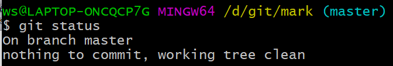
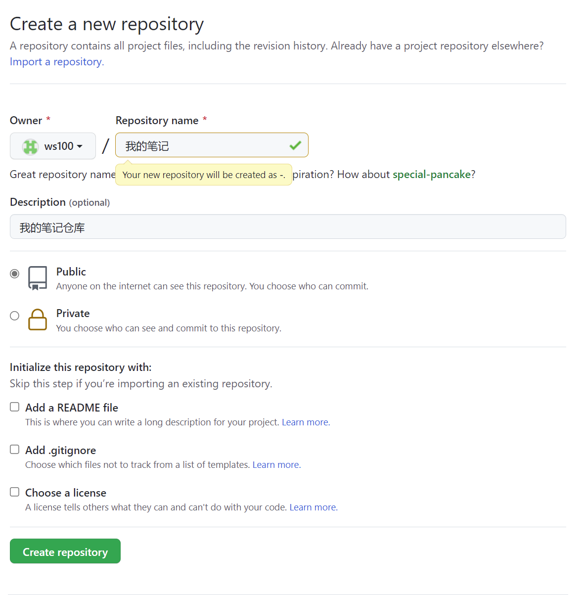
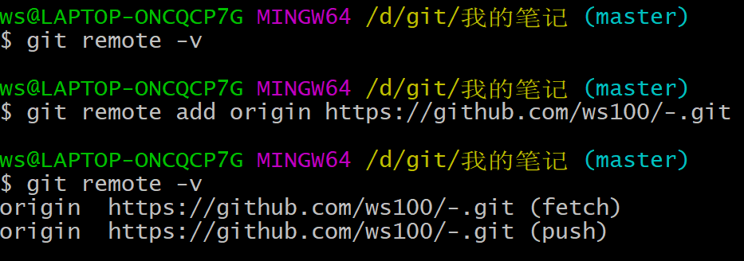

# Git常用命令


## 初始化

### 打开GitBash


### 查询git版本

```
git --version
```
### 清屏

```
clear
```

### 设置用户名和邮箱

```
git config --global user.name "ws"
git config --global user.email "1841657140@qq.com"
```

### 创建并进入文件夹

```
mkdir mark
cd mark
```

### 初始化操作

```
git init
```
#### **创建成功出现（master）**


#### **新创建的文件**


## add和commit命令

**文件和.git同一个目录**


### 提交到暂存区

```
git add demo.txt
```

### 提交到本地库

```
git commit -m "这是一个文件"
```

- **-m 表示注释**


### 注意

- **不放在本地仓库的文件，git不管理**
- **放在本地库中的文件，git也不管理，必须通过add，commit命令才可以使用git**

## status命令

```
git status
```

### 全部被管理时



### 新建demo2（没有被管理）


### 执行add命令后


### 执行commit命令之后


### 文件被修改


## log命令

```
git log
```

### 显示日志


### 分页效果（当日志过多时）

- 下一页：空格
- 上一页：b
- 尾页：显示END
- 退出：q

### 在一行内显示

```
git log --pretty=oneline
```


```
git log --oneline
```


### 显示带指针的日志

```
git reflog
```


## reset命令

### 通过reflog查看日志（通过索引回退）

```
git reflog
```


### reset命令回退

```
git reset --hard 7528a4e
```

### 再次查看reflog


### 文件回到历史版本


### hard，soft，mixed

#### hard

| **（更    改）** | **（更    改）** | **（更    改）** |
| :--------------: | :--------------: | :--------------: |
|    **工作区**    |    **暂存区**    |    **本地库**    |

#### mixed

|   **工作区**   | **（更    改）** | **（更    改）** |
| :------------: | :--------------: | :--------------: |
| **（未更改）** |    **暂存区**    |    **本地库**    |

#### soft

|   **工作区**   |   **暂存区**   | **（更    改）** |
| :------------: | :------------: | :--------------: |
| **（未更改）** | **（未更改）** |    **本地库**    |

## 删除与找回

### 删除工作区

```
rm test.txt
```

### 将删除操作同步到暂存区

```
git add test.txt
```

### 将删除操作同步到本地库

```
git commit -m "删除test.txt"
```

### 查看日志


### 用reset命令找回

```
 git reset --hard 7528a4e
```


### 找回缓存区的文件（reset第一个索引即可）


## diff命令

### 比较工作区和暂存区的文件

#### 比较一个文件

```
git diff test2.txt
```


#### 比较所有文件

```
git diff
```


### 比较暂存区和本地库的文件

```
git diff HEAD test2.txt
```


### 通过索引比较

```
git diff 43f655a test2.txt
```


## 分支

### 示意图


### 分支的好处

- **同时多个分支并行，提高开发效率**
- **一个分支失败不影响其他分支**

### 查看分支

```
git branch -v
```


### 新建分支

```
git branch branch01
```


### 切换分支

```
git checkout branch01
```


### 合并分支

#### 合并命令（出现冲突）

```
git merge branch01
```


#### 查看冲突

```
cat test3.txt
```


#### 解决（修改后重新提交）

```
git add test3.txt
```

```
$ git commit -m "修改好了"
```


# GitHub


## 创建一个库



## 将本地资源推送到远程库

### 远程库的地址


### 将地址保存

```
 git remote add origin https://github.com/ws100/-.git
 git remote -v
```



